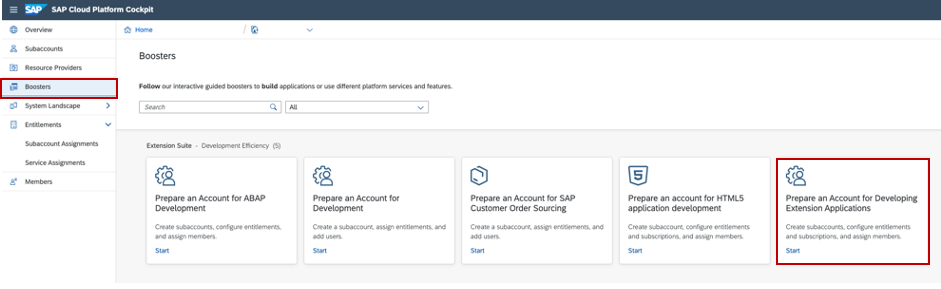
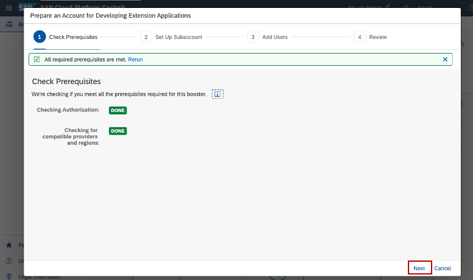
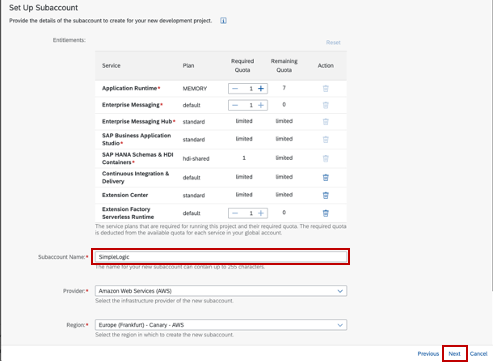
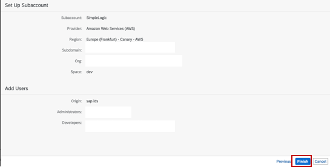
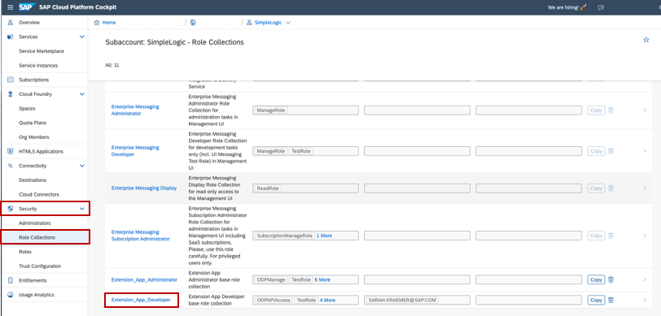
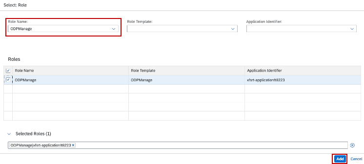

# Prepare and configure your SAP Cloud Platform environment with the help of boosters

## Introduction

You will now prepare your SAP Cloud Platform Account, configure your entitlements and configure your account for our extension scenario.

**Persona:** SCP Developer

### Prepare your SAP Cloud Platform Account

1. Navigate to *Boosters* 
2. Search for 'Prepare an Account for Developing Extension Applications'

   

3. Click on the tile and chosse the *Start* button to start the creation of your account

   

4. Check if you fulfill all prerequisites and then choose *Next*

   
   
   
5. On the next screen you can set up your Subaccount: 

 - Enter Subaccount name - eg: "Simplelogic"
 - You can edit the smaller org name, space name (optional)
6. Click on *Next* to finish

  

7. On the next screen you can add your needed Users:
 - Enter Administor's ID (you can enter IDs of people you would like to have the admin role)
 - Enter developer's ID
8. Click on *Next*

 

9. After you reviewed your account click on *Finish* 

10. Now click on your Subaccounts Name to open 
11. Navigate to Security -> Role collections and search for Select 'Extension_ App_ developer‘ and click on the name to open

12. Click on *Edit*, then '+'. Select on 'ODPAPIAccess' from the dropdown and click on *Add*
13. Click on *Edit*, then '+'. Select on 'ODPManage' from the dropdown and click on *Add*

   
   
   
14. Click on save

   
15. Navigate back to your Subaccount -> Entitlements

16. Click on *Configure Entitlements* then choose *Add Service Plans*

17. Search for "HANA" in the pop-up window and select *SAP HANA Service*

18. Choose '64STANDARD' in the Available Plans section on the right

19. Click on *Add 1 Service Plan* and save

