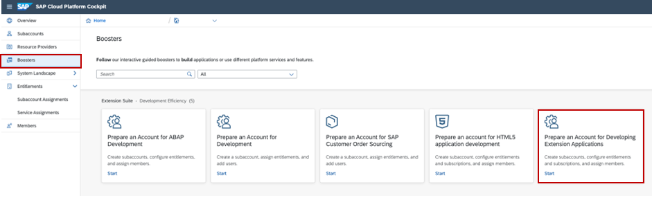
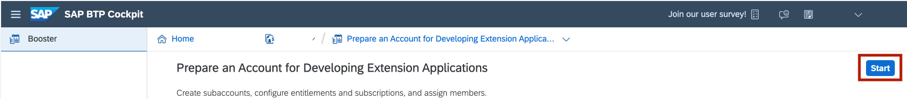
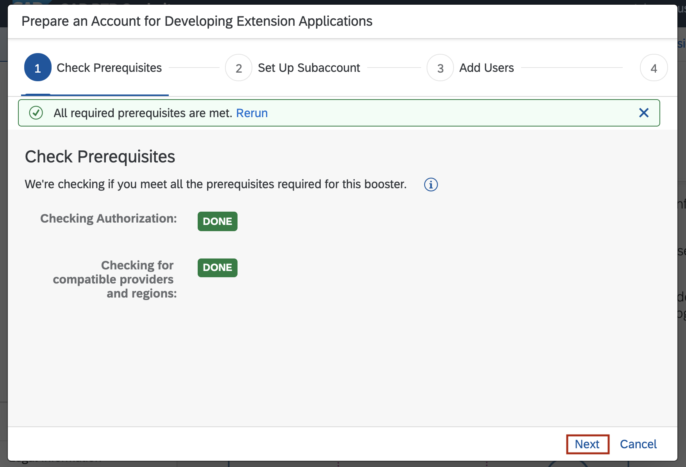
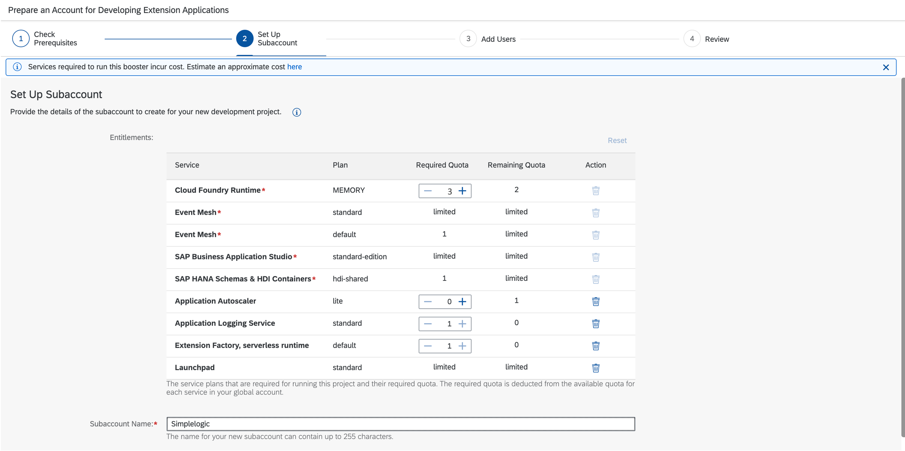
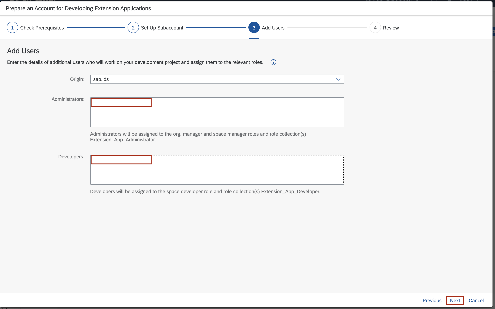
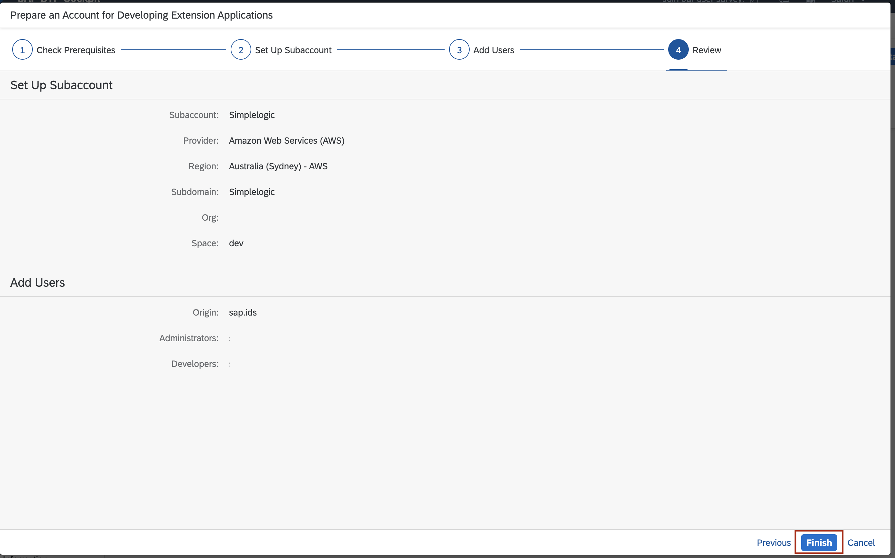
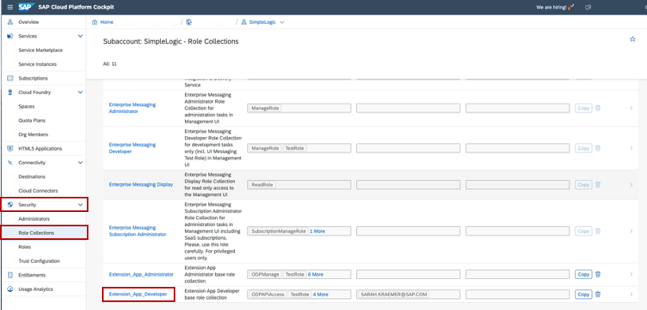
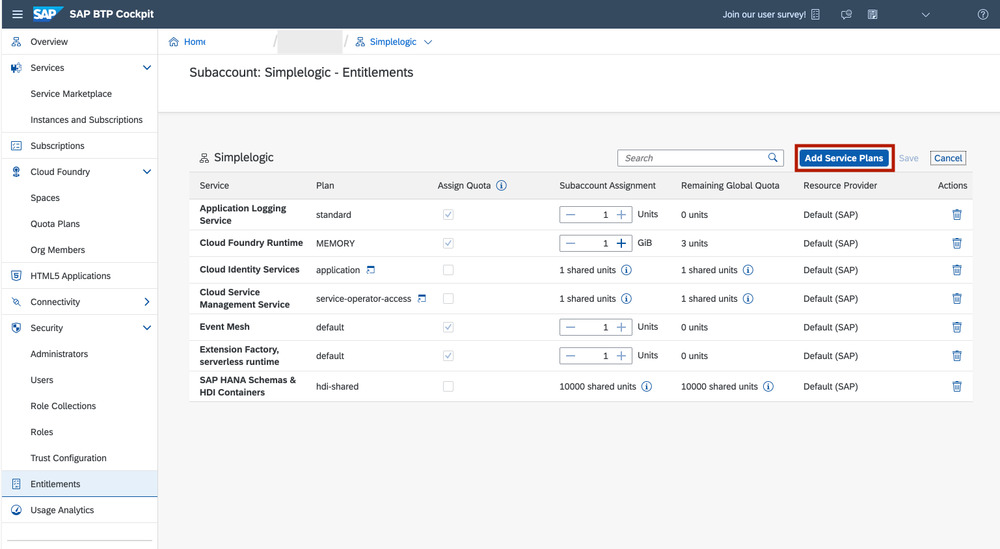
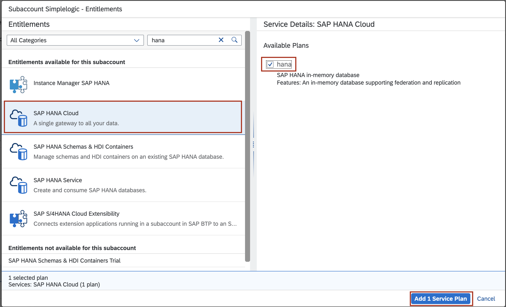

# Prepare and Configure Your SAP Business Technology Platform Environment with the Help of Boosters

## Introduction

You will now prepare your SAP Business Technology Platform, configure your entitlements and configure your account for our extension scenario.

**Persona:** BTP Developer

### Prepare Your SAP Business Technology Platform Account

1. Navigate to *Boosters* 
2. Search for 'Prepare an Account for Developing Extension Applications'

   

3. Click on the tile and chosse the *Start* button to start the creation of your account

   

4. Check if you fulfill all prerequisites and then choose *Next*

   
   
   
5. On the next screen you can set up your Subaccount: 

 - In the section Entitlements look for *Cloud Foundry Runtime* Service and increase the required quota to 3 
 - Enter Subaccount name - eg: "Simple logic"
 - You can edit the smaller org name, space name (optional)
6. Click on *Next* to finish

  

7. On the next screen you can add your needed Users:
 - Enter Administor's ID (you can enter IDs of people you would like to have the admin role)
 - Enter developer's ID
 - Select custom IDP. In case if there is no custom IDP and have chosen SAP IDP, the subscription fails. Refer the SAP Note "3580261"(https://me.sap.com/notes/0003580261)  to resolve the subscription fail.
8. Click on *Next*

  

9. After you reviewed your account click on *Finish* 

Note : Subscription to Workzone will fail as IAS is not linked. Follow this link to establish trust and subscribe to workzone
https://me.sap.com/notes/0003580261 [3580261 - Subscribing to SAP Build Work Zone fails with error: To subscribe this application link an Identity Authentication tenant to the subaccount with the "Establish Trust" option]

10. Now click on your Subaccounts Name to open 

12. Navigate to *Entitlements* and click on *Configure Entitlements* 

 

13. Then choose *Add Service Plans*

14. Search for "SAP HANA" in the pop-up window and select *SAP HANA Cloud*

15. Click on the checkbox below "Available Plans" for HANA

16. Click on *Add 1 Service Plan* and save

