# Prepare and configure your SAP Cloud Platform environment 

## Introduction

You will now prepare your SAP Cloud Platform Account, configure your entitlements and configure your account for our extension scenario.

**Persona:** SCP Developer

### Prepare your SAP Cloud Platform Account

1.	Open your *SAP Cloud Platform Cockpit*
2.	Navigate to your *Global Account-> Subaccounts*
3.	Press button to create a *New Subaccount*

   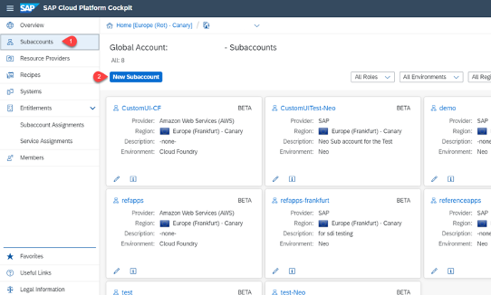

4.	Configure your Subaccount in the pop-up: 
       - *Display Name:* Choose a name 
       - *Provider:* AWS, 
       - *Region:* Europe (Frankfurt), 
       - *Subdomain:* Choose a subdomain
       - Select 'Enable Beta Features' 
       
5.	Click on *Create*

   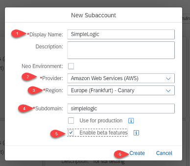
   
6.	Once your account is created, select your *Subaccount*
7.	Choose *Enable Cloud Foundry*

   
 
8.	Fill out *Organization Name* and click on *create*

   
   
9.	Select *Members* in the menu on the left and then click on *Add Members*

   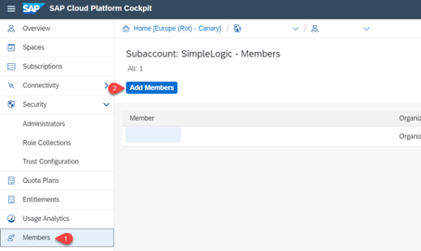
   
   Hint: Depending on your Cloud Platform Cockpit, there might be an alternative route to add users. Go to *Org Members* on the left in case that your menu structure looks different and then follow the steps below.
   
10.	Add Users to the Space by adding their IDs in the text field. *Assign Roles* as Organization Manager. Click on *OK*

   
   
11.	Switch to the *Spaces* tab and click on *Create Space*

   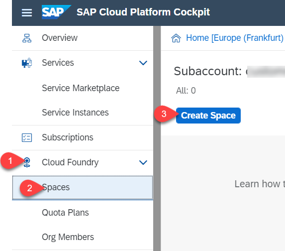
   
12.	Select *Space Name* 'BusinessPartner' in the pop up and make sure you assign the roles 'Space Manager' and 'Space Developer' and click on *Create*

   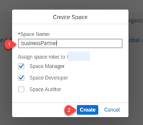
   
13.	Click on your created Space 'Business Partner'

   
   
14.	Then switch to *Members* in the menu on the left, and choose *Add Members*
   
15.	Add Users to the Space by adding their IDs in the text field. *Assign Roles* as Space Developer. Click on *OK*

      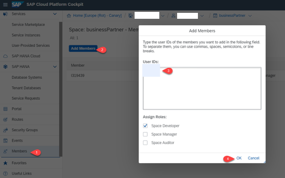
   
16.	Switch to the *Security* tab -> *Administrator*, then choose *Add Administrator*

   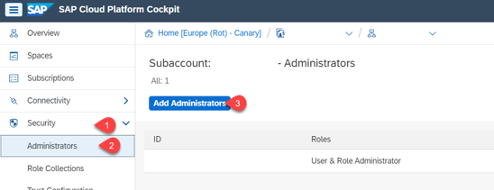
   
17.	Add Users to the Space by adding their IDs in the text field and click on *OK*

 

### Configure Entitlements

1.	Navigate to your *Entitlements -> Configure Entitlements*

  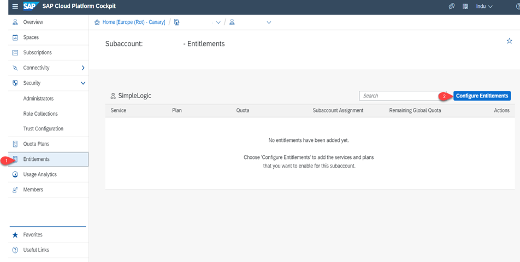
   
2.	Then choose *Add Service Plans*

   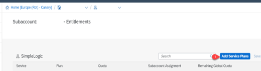
   
3.	Search for 'Enterprise Messaging', then click on *Enterprise Messaging*

4.	Select *Available Service Plans* -> 'default'

   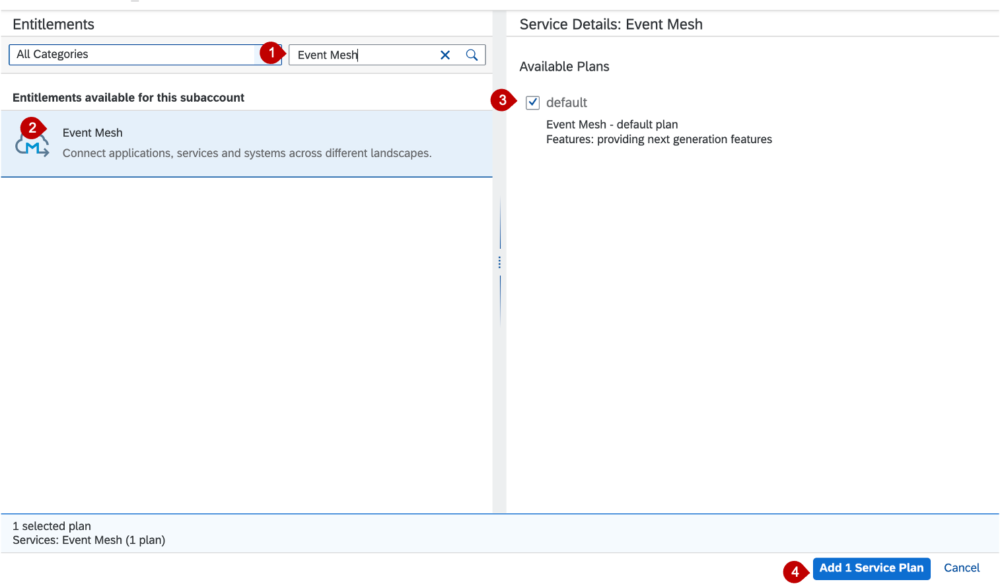

5.	Do the same for the following services:
       - '*Extension Factory Serverless runtime*' -> Select Available Service Plans -> 'default'
       - '*SAP HANA Schemas & HDI container*' ->Select Available Plans -> "hdi-shared"
       - '*SAP HANA service*' -> Select Available Service Plans -> "64STANDARD"
       - '*Application Runtime*' -> Select Available Service Plans -> "MEMORY"
6.	Click on Add 4 Service Plans and save

### Configure your account

In this scenario differed applications are needed. To use these services, you first need to subscribe to them:

1.	Navigate to your *Subaccount -> Subscriptions*
   
2.	Search for 'Continuous Integration & Delivery'

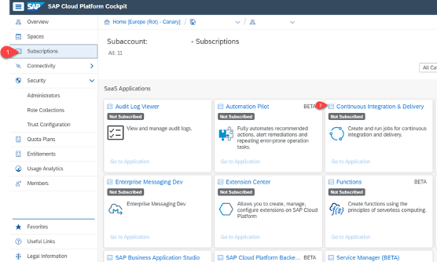

  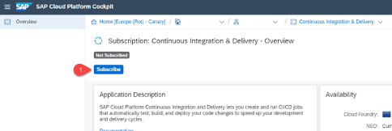
   
3.	Click on *Subscribe*

  

4.	Repeat step 2&3 for 'Enterprise Messaging', 'Business Application Studio' and 'Extension Center' to subscribe to all needed applications.

### Set up roles

1.	Navigate to your *Subaccount -> Security*

2.	Choose *Role Collections* 

 
  
3.	Create a *+*:

        Name:'Serverless_RoleCollection'
        Description: ''
        Click on create
     
 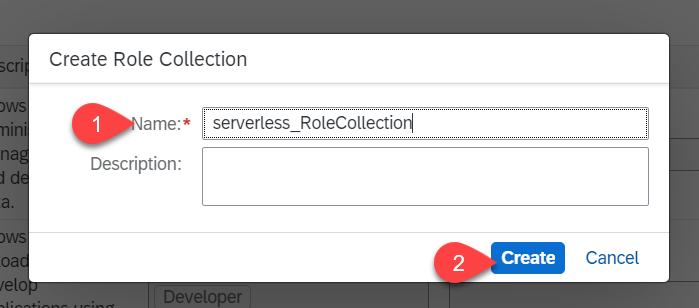
     
4.	Click on the name of your new role collection and choose *Edit*

 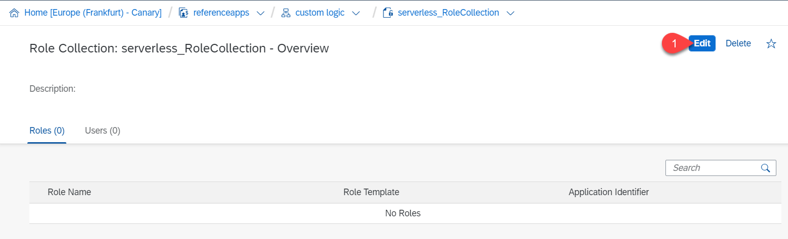
 
5. Click on *+* and click on the value help for role
 
 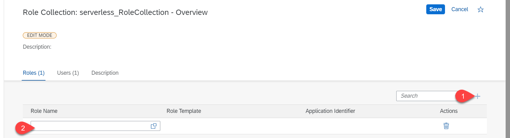      
       
6. Select *FunctionsManage* as the role. Click on the checkbox and click on *Add*

  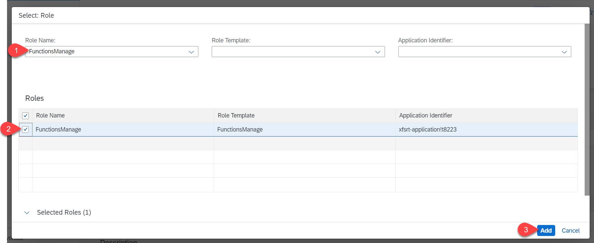

7. Repeat steps 5,6 for *ODPManage* role
 
8.	Click on *Save*
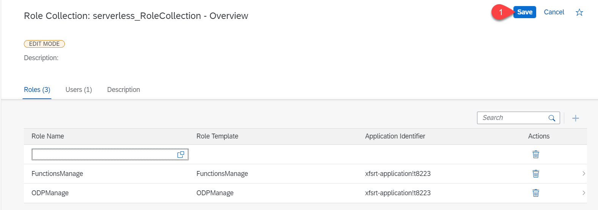

9.	Navigate Back to your *Subaccount* -> *Trust Configuration* and choose *SAP ID Service*

10.	Insert your E-Mail in the according field and click on *Show Assignments*

 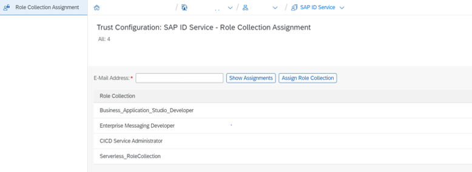 
 
11.	Click on *Assign Role Collection* then select  'Business_Application_Studio_Developer',

  
 
12.	Repeat Step 8 for the following role collections: 'Serverless_RoleCollection' 
'CICD Service Administrator' and 'EnterpriseMessagingAdmininistrator'

