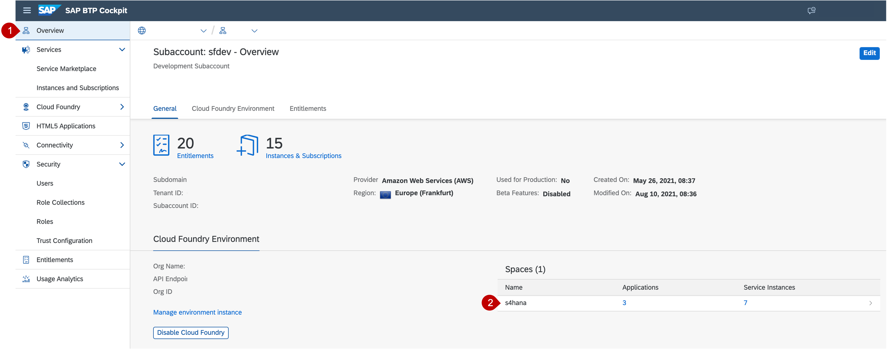
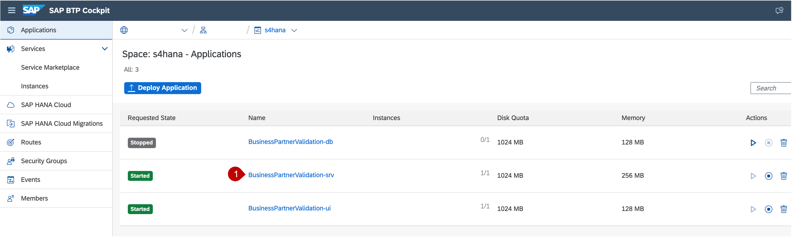
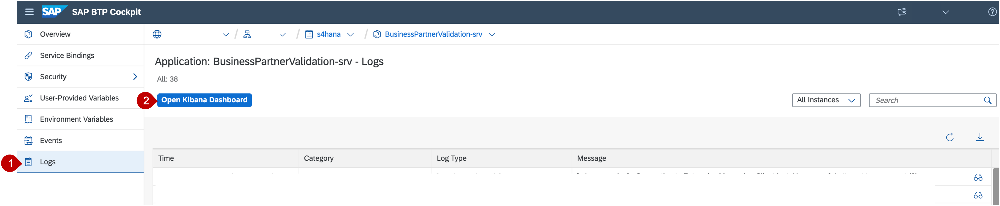
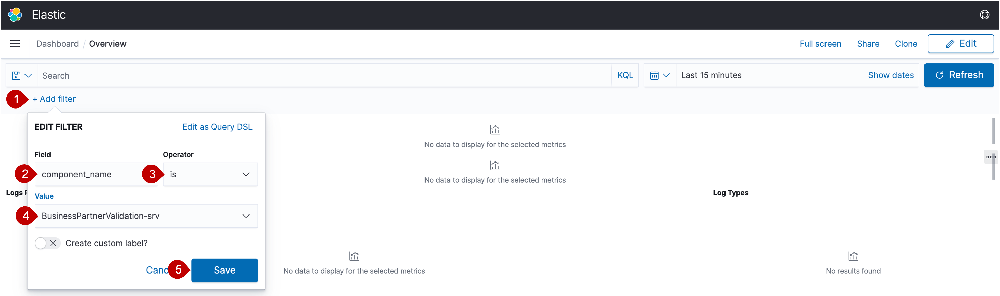

# Add SAP Application Logging Service to your application

To store and visualize application log data while using the app, SAP Application Logging Service is used.

## Requirements
Make sure you have included the entitlement for application logging service in your SAP BTP subaccount.

## Enable Monitoring and prepare Kibana Dashboard

1. Go back to your SAP BTP subaccount and navigate via cockpit to your *cf space*
     
2. Now, click on the application link "BusinessPartnerValidation-srv", to open the application
     
3. In the menu on the left side choose *Logs* and click on the button *Open Kibana Dashboard*
    
4. After the Kibana Dashboard is loaded, choose *Add filter* on the top right of the page and add following data:
    - Field: component_name
    - Operator: is
    - Value: BusinessPartnerValidation-srv
    
5. Then choose *save* and check the displayed logs in the dashboard
