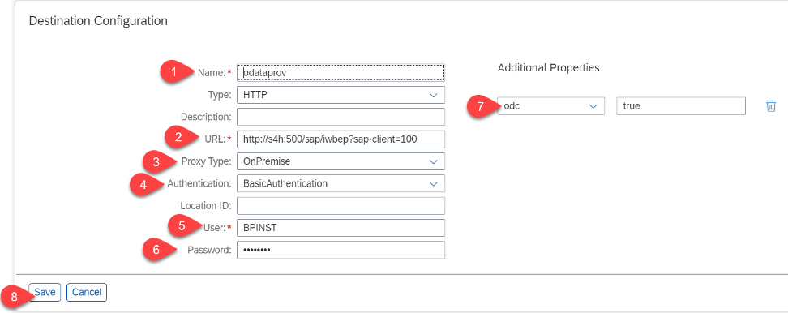

## Enable IWBEP component in the S/4HANA system

First we are going to enable the IWBEP component in the S/4HANA On premise system.

1. Login to the S/4HANA System
2. Go to transaction *sicf*

 

3. Click on execute
4. Traverse to default_host -> sap -> iwbep

 

5. Right click on iwbep and select *activate service*

 
 
6. Confirm in the popup by clicking *Yes*

 

## Configure OData Provisioning Destination

1. Create an ODP destination in the SAP Cloud Platform Cockpit

- Go to the SAP Cloud Platform Cockpit
- Expand Connectivity
- Go to Destinations
- Press button *New Destination*

- Create a destination named *odataprov* and use the details as provided below 
 - url : http://< *virtual host* >:< *virtual port* >/sap/iwbep?sap-client=100
 - Proxy Type : On-Premise
 - Authentication: Basic
 - Location Id : 
 - User: S/4HANA System User name
 - Password: S/4HANA System password
 - Additional Properties: odc true
 
 To add an additional property, click on *add new property*.
 
 2. Click on *save* after creating the destination. 
 
  
 
 3. Optionally you can check the connectivity.

