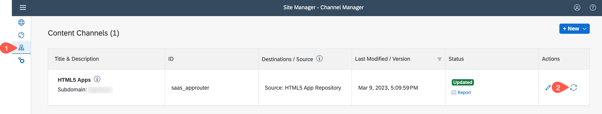
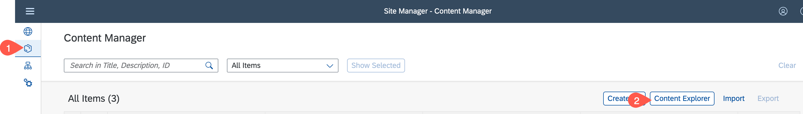
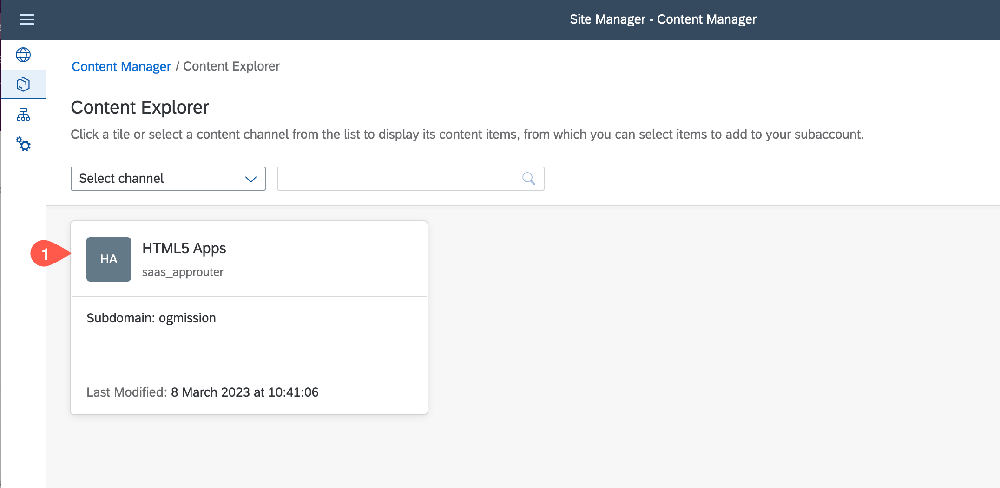
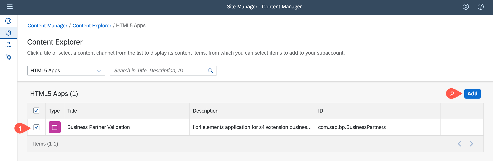
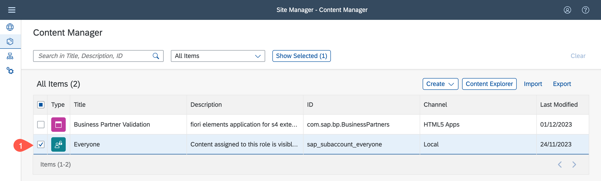
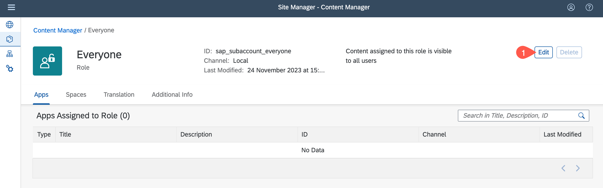
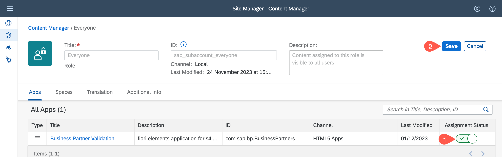
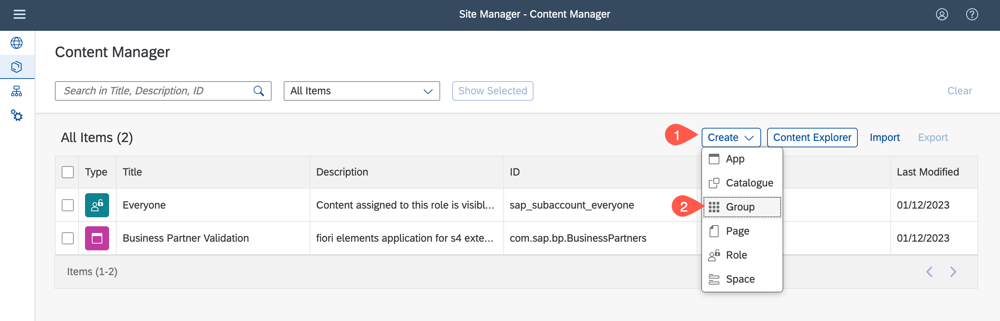
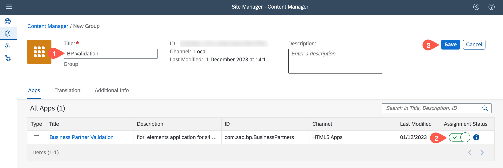

# Integrate the Application to SAP Build Work Zone, standard edition

## Introduction

In this section, the application will be connected to SAP Build Work Zone, standard edition to display the application from the launchpad

**Persona:** BTP Developer

###  Integrate with SAP Build Work Zone, standard edition

1.  Open your Subaccount and search for *Instances and Subscriptions*
2.  Search for the application *SAP Build Work Zone, standard edition* and click on icon to open
3.  Now are on the home page of SAP Build Work Zone, standard edition. In the menu on the left side click on the icon for *Content Channels*
4.  Click on the refresh icon to fetch the updated content

    
    
5.  Choose **Content Manager** in the menu on the left and choose **Content Explorer** button

    

 6. Select the tile **HTML5 Apps** with your respective subdomain name.

    

7. In the table, set checkmark for your applications *Business Partner Validation* and choose the **Add** button.

    

8. Navigate back to **My Content** and choose on role **Everyone** in items table 

    

9. Choose **Edit** button

    

10. Find your applications *Business Partner Validation* in the table. In row Assignment Status switch toggle button to on. Choose **Save**

    

11. Go back to **Content Manager** tab, choose Create button and select **Group** from the dropdown

    

12. Add the title *BP Validation*.

13. Find your application *Business Partner Validation* in the table. In row *Assignment Status* switch toggle button to on.

14. Choose Save.

    

15. Go Back to the *Site Directory* and click on button to *Create Site*
16. Enter the site name as 'BP Validation' and click on *Create*

     
    
17. Navigate to Site Directory
18. Find your created site and open it by clicking on the icon *Go to site*
 
     
    
19. Congratulations! You now can use your created application 
     
