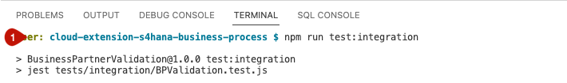

# Run an Integration Test

## Introduction

Now we run a unit test to ensure that all the components of a system are working together as expected. Integration tests are used to test the integration of components such as databases, web services, APIs, and user interfaces. Integration tests are typically performed after unit tests have been completed.

**Persona:** BTP Developer

### Run Integration Tests in your Application

1. First you need to wirte the integration Test. In this exercise there is already a pre prepared integration tests created in [GitHub](https://github.com/SAP-samples/cloud-extension-s4hana-business-process/blob/main/tests/integration/BPValidation.test.js). In case you habe not cloned the repository in an earlier step, copy the files to your created repository.

3. Open the terminal and run the following test script


```
npm run test:integration

```

