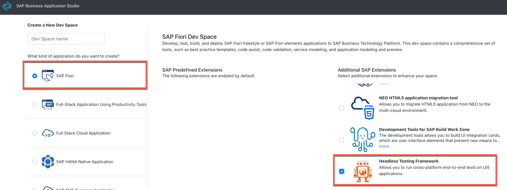
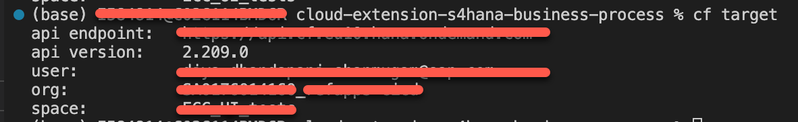
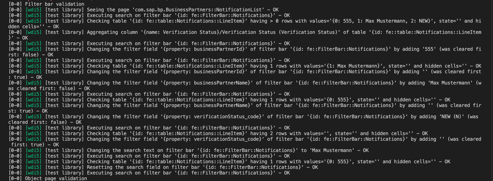

# Run UI Tests

## Introduction

Another set of tests that can be executed are the UI tests, where the application's interface is assessed on the basis of performance and functionality. The main objective would be to test the features that a user would interact with. This is done by mimicing the user actions and automating them on the browser with help of some automation framweork. These tests would ensure optimal user experience by minimizing glitches and slow load times and validate whether the desired functionalities can be carried out.

**Persona:** BTP Developer

### Prequisites:
1. Nodejs environment
2. Running UI5 application
3. Chrome browser 

### An introduction to the Webdriver.IO (WDIO) framework

For this mission the [Webdriver.IO framework](https://webdriver.io/), also known as WDIO, is used to perform the browser automation. It is rooted in node.js and is built on top of the selenium webdriver API using javascript. This means that node.js functions as the runtime environment, responsible for executing the test scripts. 
The framework is designed to automate not only web applications but mobile and native desktop apps as well. Webdriver.IO offers features such as :
    - **Cross-browser testing** : Supports applications to be tested across multiple browsers
    - **Built-in logging and reporting** : Provides an effective manner to comprehend test outcomes in the form of detailed reports
    - **Compatibility with other frameworks and services** : Allows for seamless integration thus satisfying varied project requirements
    - **Protocol support** : Compatible with both the Webdriver and Devtools protocols which are supported by most modern browsers
    
The WDIO test runner **'@wdio/cli'**, allows users to configure their testing environment in a straight-forward manner with the help of just a few commands. This setup would do the following:
- Creates a **wdio.conf.js** file which holds all of the necessary environment configuration details
- Adds certain dependencies to your **package.json** file and installs them as well
- Adds a script to the package.json file to excute the scripts

### The wdi5 service

The [wdi5 service](https://ui5-community.github.io/wdi5/#/) is available as a part of the Webdriver.IO framework. It is built on top of the UI5 test API and bridges the gap between WDIO and the UI5 framework by being more aware of UI5 contols. As a result better synchronisation between the two frameworks is achieved. SAP BTP's Business Application Studio also extends wdi5 support through the Headless Testing Framework. Adding this framework to your space downloads the firefox browser thus allowing you to execute browser based tests.


With wdi5, users can test both traditional UI5 and fiori applications. For the purpose of testing fiori apps, the service is integrated with the [OData V4 Test Library](https://sapui5.hana.ondemand.com/#/api/sap.fe.test), making it convenient to write the test scripts. This test library was originally used for running OPA5 based tests but now is extended for wdi5 usage as well. The library has a set of 'Actions' and 'Assertions' defined for different Fiori templates using which the browser can be controlled. This minimizes the need to explicitly define the controls and views of a page making the test scripts more UI5 friendly.

**NOTE : For this mission we are making use of wdi5^1.5.0 and thus will be using wdio^7**

### Environment Configuration

As mentioned above, the wdio.conf.js file inside app/BusinessPartners holds all the configuration details in the config object. In the package.json, in the same folder, has the corresponding dependencies which supports the configurations mentioned. . This was set up using the WDIO test runner's @wdio/cli. 

For this mission, we stick to the set up described below:

| Configuration in the wdio.conf.js file        | Corresponding packags.json dependency         | 
| -------------                                 |:-------------:                                | -----:|
| Chrome mentioned in **Capabilities**          | chromedriver                                  | Executes the tests on the chrome browser, the **chromedriver** dependency is needed to create the browser sessions |
| Mocha  mentioned in **Framework**             | @wdio/mocha-framework                         | Allows us to write tests using this framework, the dependency acts like an adapter package  |
| Spec  mentioned in **Reporters**              | @wdio/spec-reporter                           | To generate reports in spec style |
| Chromedriver mentioned in **Services**        | wdio-chromedriver-service                     | Enables communications with the chrome browser drivers |
| UI5 mentioned in **Services**                 | wdio-ui5-service                              | Allows the usage of wdi5 |

Other details mentioned in the configuration file includes : the path of the test files, browser timeouts, hooks to be executed etc.

If you would like to try writing your own tests, [this would be the place to start](https://v7.webdriver.io/docs/gettingstarted/). You can follow the steps mentioned here to set up your testing environment. 

### Understand the Test Cases

Now lets understand the structure of the tests in brief.

1. In the test.spec.js file insider tests/ui/specs, we include:
    - the fiori page configurations which are required for making use of the testing library (The details required for this can be found in the manifest.json file inside app/BusinessPartners)
    
    - the test suites, which are essentially the family of tests to be executed
    
2. In order to test the working of the application entirely, we begin by creating our test data. In this case this means creating mock business partners. Since this is only a testing environment, we will not be using actual S4 systems but rather a 'mock-server', which is essentially a CAP application that will enable us to create entities and emit events. This is mentioned as a **Git Submodule** in this repository as can be seen in the .gitmodules file. The test data is created using axios calls to this mock server. These calls can be found in the tests/ui/services/bpApi.js file. 

3. Following this the application page functionalities are validated. This is done by making use of the library functions mentioned above:


As shown in the image, the tests are written in the form of **When** and **Then** statements which will respectiveley execute the Actions and Assertions(like mentioned aboved). 
For instance, in the above example we display all rows of a table using the Search button of the Filter Bar. This is our Action.
Following this, we check if a particular entry/row is visible in this table. This is our Assertion.

For each When/Then statement the corresponding fiori page is required. The appropriate functions to be used with each template can be found in the [Test Library](https://sapui5.hana.ondemand.com/#/api/sap.fe.test) under the **List Report** and **Object** pages. Each has its own set of actions and assertions which may require certain parameters to identify controls/views. These parameters can be found by inspecting your webpage.

4. Finally we end with deleting the test data from both the application and mock server.


### Run UI Tests in Your Terminal

NOTE: Ensure you have the chrome browser installed on your system and you have the mission repository cloned as well.

1. First we need to fetch the mockserver submodule. Open your terminal, navigate to the root folder and run :
    ```
        git submodule init
        git submodule update
    ```
Ensure the mock-srv folder is not empty and has this structure.


2. Now you need to deploy both the application and mock server. For this you need to make use of the mta_Test.yaml file which has the **mock-srv** module defined to deploy the mock server. So first change the name of the current file **mta.yaml to mta_Prod.yaml** and change **mta_Test.yaml to mta.yaml**. You file structure should now look like:
.

3. Now open your terminal login to any subaccount and space of your choice :
    ```
        cf api <API-ENDPOINT>
        cf login -u <USER-ID> -p <PASSWORD>
        cf target -o <ORG> -s <SPACE>
    ```

4. Deploy your application as :
    ```
    mbt build 
    cf deploy mta_archives/BusinessPartnerValidation_1.0.0.mtar
    ```

5. In the root folder, create a **.env** file. In this file you need to define some of the urls needed as evironment variables. For this you will need both the org and space name. In your terminal execute:
    ```
        cf target
    ```
    This will print the the necessary details as the following:
    

    Make note of the api endpoint, org and space name. 

***NOTE :***
**For the variables definition below ensure the following:**
**- to replace any '_'(underscore) in the org or space name with a '-'(hyphen)**
**- all upper case alphabets in the org and space name must be mentioned as lower case**
**- for the endpoints, only include the portion after 'cf'**

***For example if your org name is ABC_Org-name, space name is SPACE_NAME and endpoint is https://api.cf.end.point.com you must mention them as abc-org-name, space-name and end.point.com***

    Environment variables need to be defined in the below form in the .env file.
    ```
        variableName=value
    ```

In this manner define the following:
    - mockUrl : https://{orgName}-{spaceName}-mock-srv.cfapps.{endPoint}/odata/v4/api-business-partner/A_BusinessPartner

**For the below url for the org name, **do not include** the portion before the '_'(underscore).  i.e., if your org name is ABC_Org-name, include it as org-name only**.
    - appAuth : https://{orgName}.authentication.{endPoint}/login

You would also need to mention your subaccount's username and password in your .env file if:
- you do not have SSO enabled in your browser
- you are running your tests in headless mode ie., no browser window would pop up

Add them in the following manner:
- wdi5_username={username}
- wdi5_password={password}

This is what your .env file should look like:


6. Now in your terminal run this command to navigate to the folder from where we need to trigger the tests:
    ```
        cd app/BusinessPartners
    ```
    Next, you will need to find out the current version of your chrome browser. For this open your chrome browser and search for :
        ```
            chrome://settings/help
        ```
    Here you will find the exact version.


For example according to this image, the browser version is 117.

    Open the package.json file in app/BusinessPartners and modify the chromedriver dependency version to the value of your chrome browser. In this case it should be "chromedriver" : "117".

    After this install the dependenices as :
    ```
        npm i
    ```

7. Now its time to run your tests. First lets run it normally i.e., in non-headless mode. For this open the wdio.conf.js file in app/BusinessPartners and comment out (using ctrl+C) the following portions under **Capabilities** as shown below.


If you do not have SSO enabled in your browser, leave the wdi5:authentication portion uncommented.

8. To run the tests you need to pass the url of the application with the command. The template of the url is mentioned beloew. In your terminal run:
```
    npm run wdi5 -- --baseUrl:https//{orgName}.launchpad.cfapps.{endPoint}/comsapbpBusinessPartnersone.comsapbpBusinessPartners-1.0.1/index.html#Shell=home
```
You should see a browser pop up and behave in an automated manner. 


You should also see logs being printed on your terminal.



Once the excution is done, you should be able to see a report of the tests.


9. To execute the tests in a headless manner, ensure you have mentioned your subaccount credentials in the .env file (explained in step 5)

10. Now go back to the wdio.conf.js file and uncomment the portion commented above. Tests can be executed in the same manner again. Note that headless mode means the test execution will not be visible i.e., a browser window will not pop up. 
 ```
    npm run wdi5
 ```
 You can keep tracks of the tests through the logs and finally the test report generated the same as above.

11. Now you can go back and undeploy your application using the cf undeploy command. Please ensure to manually delete the destinations **ui5** and **bupa** from the **Destinations** section of the BTP Cockpit as it would not be removed during the undeployment stage due it being a subaccount level destination.


