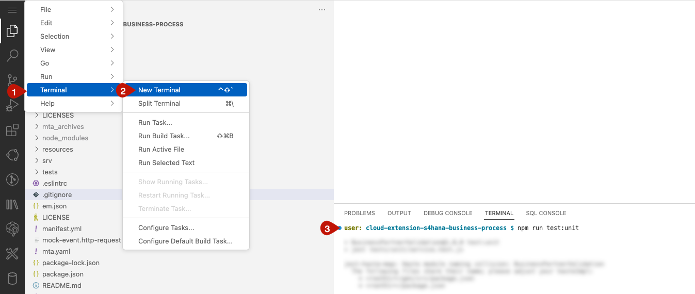
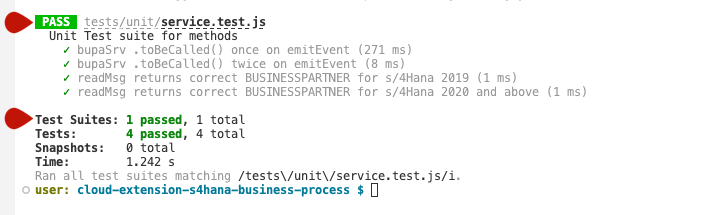

# Run a Unit Test

## Introduction

Now we run a unit test to ensure individual units of the code are working as expected. Unit tests are usually run automatically, and they can be used to quickly identify any issues with the code.

**Persona:** BTP Developer

### Run Unit Tests in your Application

1. To run unit tests for your application you need to first define which parts of your application need to be tested. In this sample application it is testes if the correct Business Partner is loaded in the application

2. Then you need to wrtie the unit test. In this exercise there is already a pre prepared unit tests created in [GitHub](https://github.com/SAP-samples/cloud-extension-s4hana-business-process/blob/main/tests/unit/service.test.js). In case you habe not cloned the repository in an earlier step, copy the files to your created repository.

3. Open the terminal and run the following test script


```
npm run test:unit

```




4. Check terminal to see results of the test


