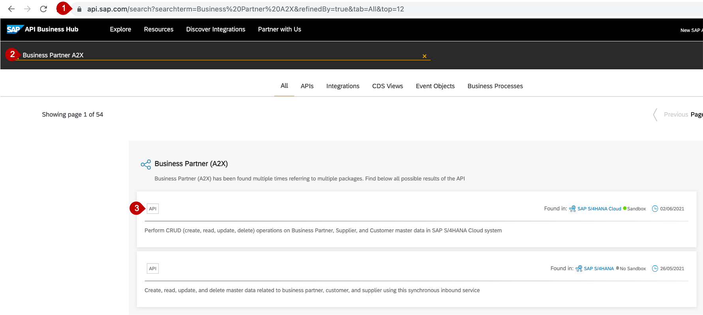
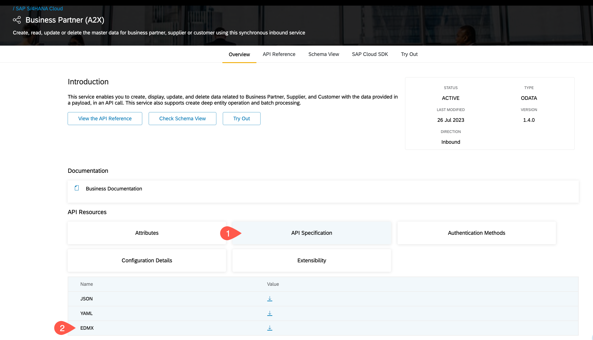

# Lookup API in API Business Hub

## Introduction
For a start we will use a mock server to mimic the backend. This allows us to start developing our application without a fully configured and connected backend in place. Later on in this mission we will configure and use your SAP S/4HANA backend. 

In order for this mock server to be able to expose the required Business Partner API we need to provide the API specification. This specification can be found in the SAP API Business Hub.

So, as a preparation step, we will first Download the API Specification from API Business Hub.

**Persona:** BTP Developer

### Find and download API

1. Open [SAP API Business Hub](http://api.sap.com)
2. Enter Business Partner in the Search Tab. 
3. Click on the Search Button
4. Click on Business Partner (A2X)

 
 
5. Scroll down to *API Resources* and click on *API Specification*
6. Choose EDMX and click on the icon to download

 
 

