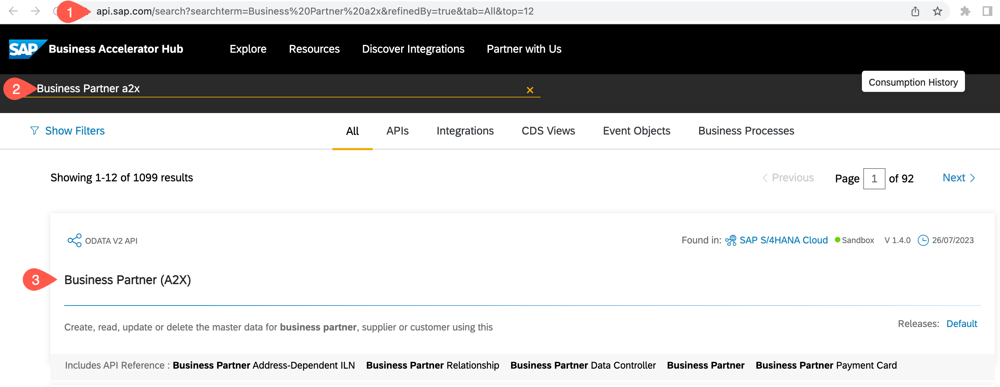

# Lookup API in API Business Hub

## Introduction
You will look up the required API on API Business Hub and download its specification as an EDMX file. 

**Persona:** BTP Developer

### Find and download API

1. Open http://api.sap.com
2. Enter Business Partner in the Search Tab. 
3. Click on the Search Button
4. Click on Business Partner (A2X)

 
 
5. Scroll down to *API Resources* and click on *API Specification*
6. Choose EDMX and click on the icon to download

 
 

