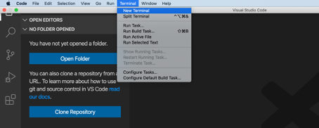

# Prepare Development Environment for the SAP Cloud Application Programming Model

## Introduction

With this guide you will set up Node, create a new GitHub Repository and prepare Visual Studio code for development on your local machine. 

**Persona:** BTP Developer

### Set up Node

1.	Open link: 'https://nodejs.org/en/'
2.	Choose and download the recommended version for most users
3.	Follow the instructions to install node

### Choose GitHub Repository

1. Go to 'https://github.com/'
2. Click on "+" and choose *New Repository* in the dropdown
3. Choose a name e.g. "BpValidationS4" and click on checkbox to initialize the repository with README
4. Finish the creation with a click on *Create Repository*


### Prepare your local development environment

1.	Open Visual Studio Code	
2.	Click on *Terminal* and choose *New Terminal* in the dropdown menu
	
   


3.	Clone the repository you created ealier with executing the command: 

```
git clone <Repository-link>
```

> Hint: In case of any authorization issue  use the command: ``` git clone --single-branch --branch "main" "https://access_token@github.com/repo.gt/" ```

4.	Install cds with the command: 

```
npm i -g @sap/cds-dk
```
5.	Change the directory to the directory right above the repository. 
```
cd repo
```

6.	Initialize CDS 
```
cds init BpValidationMockS4
```

