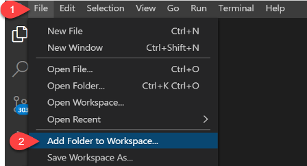
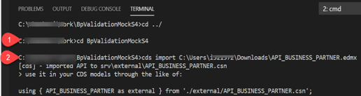
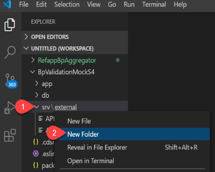
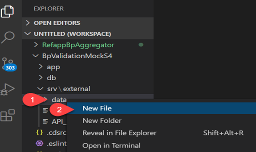
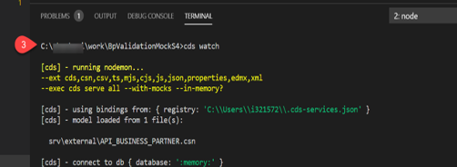
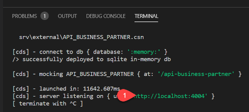
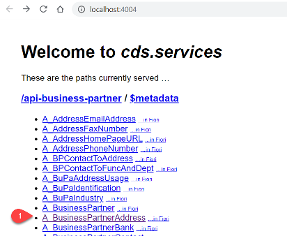

# Develop application in a nutshell with mock S/4 HANA Service

## Introduction
You will now develop a CAP application in a nutshell using Visual Studio Code. In a later step you will then replace your code in GitHub with the reference application code.

**Persona:** SCP Developer


### Develop application against Mock API

1. Open Visual Studio Code
2. Click on *File* and choose *Add Folder to Workspace* in the dropdown menu

      
   
3. Open a *terminal* and change to the right directory by executing the command 
```
cd BpValidationMockS4

```

4. Execute the command 
```
cds import API_BUSINESS_PARTNER.edmx
```

Hint: make sure the EDMX file is in your folder or provide the path to the EDMX file. This is the file you have downloaded from the API Business Hub in an earlier step. 



5. Navigate to the *srv/external* folder in the explorer and click right to open the dropdown and choose *New Folder*



6. Name your created folder 'data'

7. Now click right on your created data folder and choose *New File* in the dropdown



8. Name your created file 'API_BUSINESS_PARTNER-A_BusinessPartnerAddress.csv'

9. Now open the file and copy the text on the right into the file:

 ```
 BusinessPartner,AddressID,StreetName,CityName,Country,postalCode 

"17100001","124462","Dietmar-Hopp-Allee 162","Walldorf","DE","12345" 

"17100005","124465","whitefield 162","Bangalore","IN","560066“

```


10.	Save the file

11.	Open the terminal again, and execute 
```
cds watch
```


12.	Click link to open the port in the browser (or copy it into the browser's address bar)




13.	In the *browser* click on A_BusinessPartnerAddress to view the address



### Switch to Reference Coding for Mock API app
 
1.	Go back to *Visual Studio Code* and open the terminal (go to the workplace, right click and select Open Integrated Terminal)

2.	Replace your code with reference application code 

Clone the code from our reference application GitHub https://github.com/SAP-samples/cloud-extension-s4hana-business-process.git

```
git clone https://github.com/SAP-samples/cloud-extension-s4hana-business-process.git
```

Then copy everything in the directory created (cloud-extension-s4hana-business-process) over to your directory (BpValidationMockS4), replacing the original content.

3.	Update your GitHub repository  

In a next step update your GitHub repository with the reference application that you have copied over. 

``` 
git add .
git commit -m '<comments>'
git push
```

