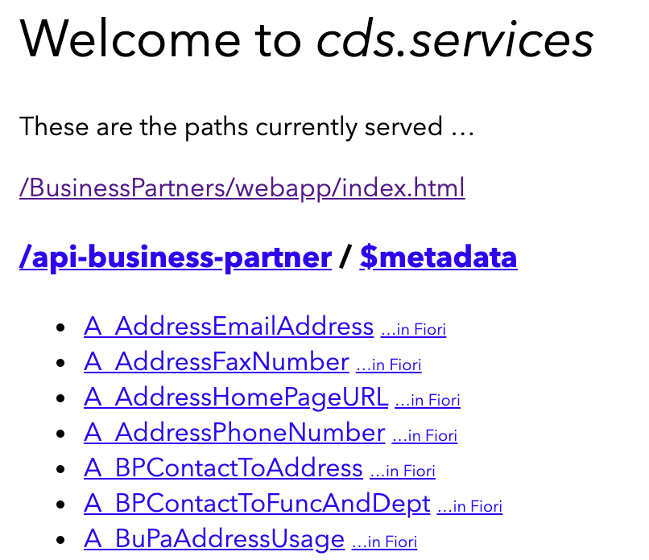
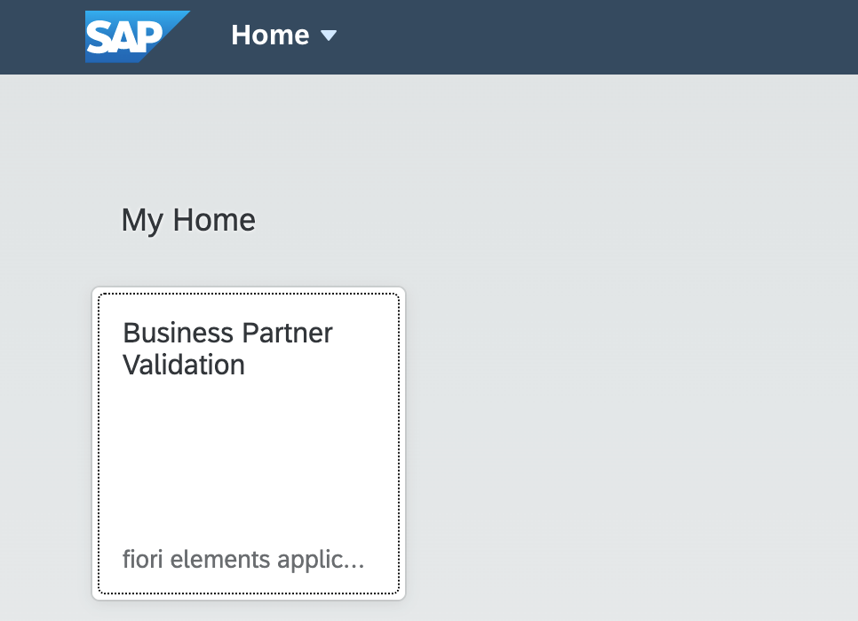

# Test application against S/4HANA Mock Service

## Introduction
You will now test the application you have created against an S/4HANA mock service 

**Persona:** BTP Developer


### Test application 

1.	Open the terminal and go to your application folder. Then execute:

``` 
npm install
CDS watch
 ```
 
2.	Either click on the http://localhost:4004 link or copy the URL to your browser and execute it.

3. Click on the WebApp that is displayed almost on top of the list:

/BusinessPartners/webapp/index.html

   

4. You will now see the WebApp started up and can play around with it.

   
