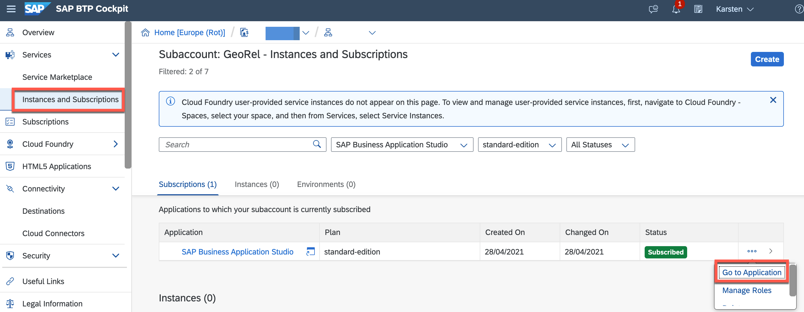
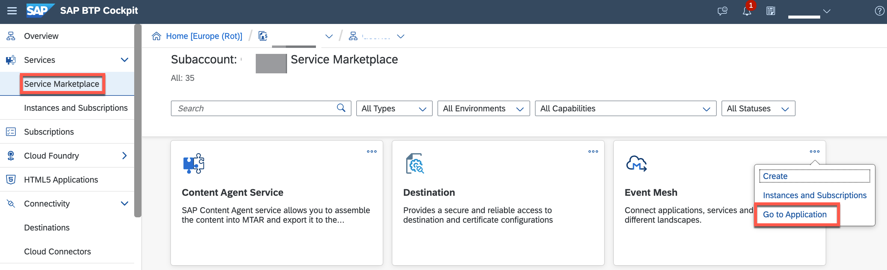
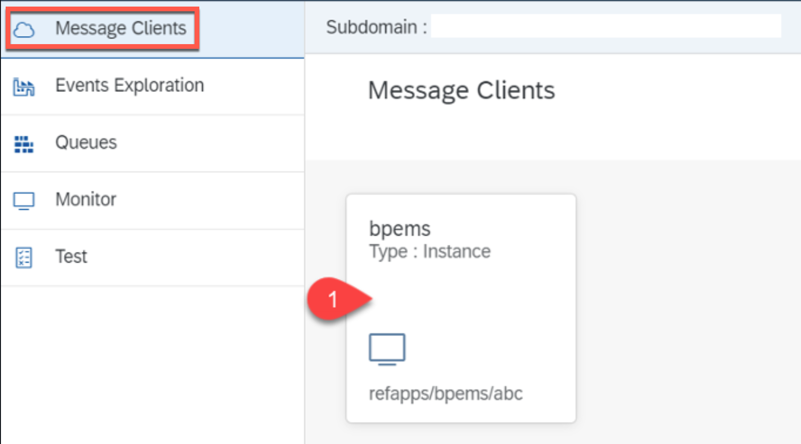
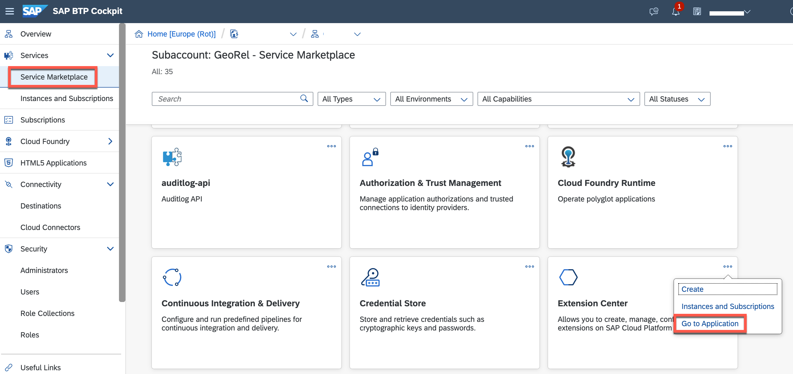
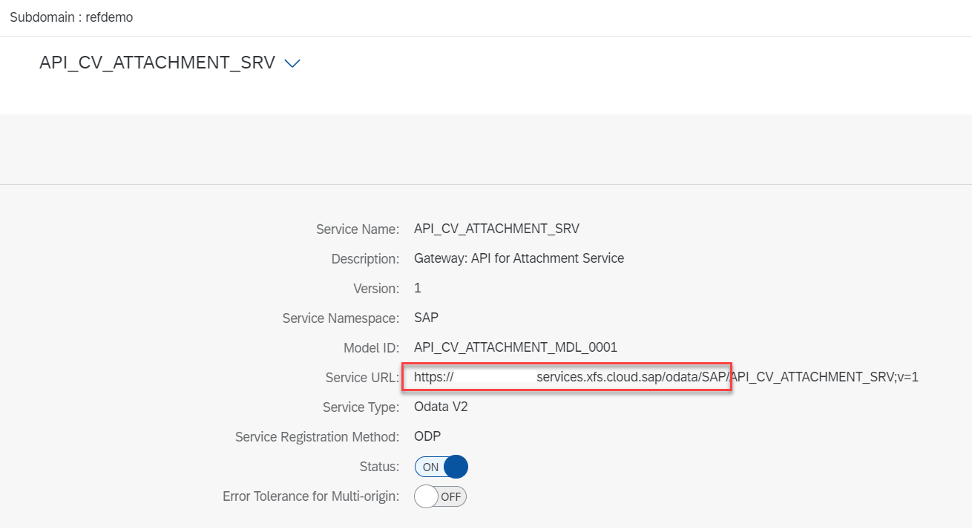
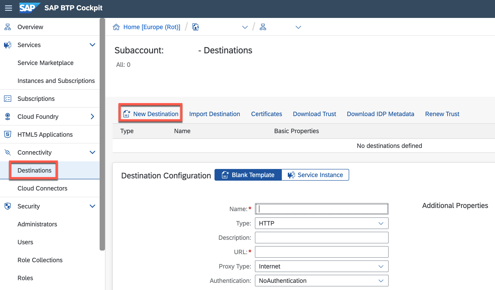
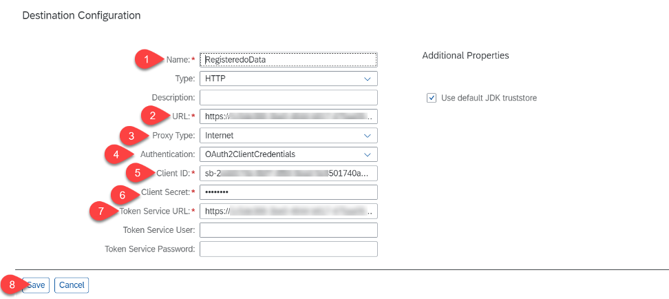
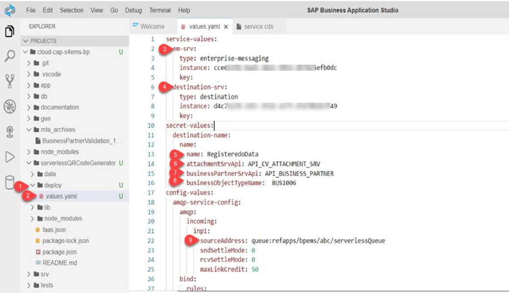

# Develop Serverless Function-as-a-Service

This serverless function is used to generate a qrcode for the updated Business Partner address and it uploads the same to the S/4HANA on premise system along with the business partner details.

The implementation showcases the following features of the SAP Cloud Platform Serverless Runtime:

  - AMQP trigger for invoking the serverless function
  - OData Provisioning for registering the S/4HANA OData Services
  - Consumption of the registered S/4HANA OData services from a Serverless function

## Requirements

* A working instance of Enterprise Messaging.
* A working instance of a Destination Service.
* A queue has been set up for receiving messages sent by the cf application
* Subscription for Extension Center
* Subscription for Enterprise Messaging App
* Subscription for Business Application Studio
* Entitlement to create a new Serverless instance (*Extension Factory, serverless runtime*).

## Deployment - Business Application Studio

1. Login to Business Application Studio



Hint: you should have enabled "SAP Cloud Platform Serverless Runtime Development" while creating a dev space in the Business Application Studio in one of the earlier steps. 

2. Open a Terminal and Login


```bash
cf login -u 'user' -p 'password'
```
 
3. Change to the serverlessQRCodeGenerator directory

```bash
cd  serverlessQRCodeGenerator
```
 
4. Create the Serverless Runtime service instance

```bash
cf create-service xfs-runtime default extension -c '{"extensions": true, "odp": true}'
```

5. Create the required keys for the Serverless Runtime, the destination service and Enterprise Messaging


- Create the Serverless Runtime service key

```bash
cf create-service-key extension xfkey
```
 
- Create destination service service - key
 
```bash
cf create-service-key <DESTINATION_SERVICE_INSTANCE_NAME> <DESTINATION_SERVICE_KEY_NAME>
```
e.g. cf create-service-key BusinessPartnerValidation-dest destkey

- Create the Enterprise Messaging service key

```bash
cf create-service-key <ENTERPRISE_MESSAGING_SERVICE_INSTANCE_NAME> <ENTERPRISE_MESSAGING_SERVICE_KEY_NAME>
```
e.g cf create-service-key BusinessPartnerValidation-ems emskey


6. Login to the Serverless Runtime instance

```bash
xfsrt-cli login -k <serverless_instance_key_name> -n <service_instance_name>
```

or alternatively log in and then select from the options

```bash
xfsrt-cli login
```


Alternatively you can just use *cf login* and you will then be asked for additional information interactively.

7. Register Enterprise Messaging Service instance

```bash
xfsrt-cli faas service register -b <Enterprise_Messaging_service_key_name> -s <Enterprise_Message_instance_name>
```
e.g.  xfsrt-cli faas service register -b emskey -s BusinessPartnerValidation-ems

Select Target - most likely 1 for you.

8. Register Destination Service instance
```bash
xfsrt-cli faas service register -b <Destination_service_key_name> -s <sDestination_instance_name>
```
e.g. xfsrt-cli faas service register -b destkey -s BusinessPartnerValidation-dest

Select Target - most likely 1 for you.


9. Confirm that the service instances are registered.

```bash
xfsrt-cli faas service list  
```

10. Install faas-sdk

```bash
npm install @sap/faas -g
```

11. Install all required node packages

```bash
npm install
```

12. Create a deployment file to provide the credentials 

Make sure you execute the command inside the project directory.

```bash
faas-sdk init-values -y values.yaml
```


## Set Up Messaging Queue required for Serverless

1. Create Queue in Enterprise Messaging for Serverless

- Go to SAP Cloud Platform Cockpit
- Click on Subscription
- Click on "Go to Application" for Enterprise Messaging



- Login using email and password


- Click on your message client



- Click on Queues.
- Click on Create Queue


- Provide a name for the queue (recommended: serverlessQueue)
- Click on Create


- Click on the  arrow icon (under Actions)
- Click on Queue subscriptions


- Provide a topic name

Provide below topic name for our scenario:

```bash
refapps/bpems/abc/SalesService/d41d/BusinessPartnerVerified
```

- Click on *Add*
- Click on *Close*


## Configuration in Extension Center

1. Login to Extension Center by going to *Subscriptions* in your Cloud Platform Cockpit and clicking on *Go to Application* in the Extension Center tile (Roles)

 

2. Once in the Extension Center, click on Services on the left hand side, then click the *Register* button 

 

Now we will register the API_BUSINESS_PARTNER  and API_CV_ATTACHMENT_SRV services 

3. Select the destination (odataprov) that you had created before. 
4. Search for API_BUSINESS_PARTNER in the Service Name field
5. Select API_BUSINESS_PARTNER
6. Click on Register

 

7. Repeat the steps above for API_CV_ATTACHMENT_SRV
8. Select API_CV_ATTACHMENT_SRV by clicking on the service name

9. Copy the front part of the service url ending with SAP/ , i.e. https://xxx.xxxx.services.xfs.cloud.sap/odata/SAP/

 

## Destinations in Cloud Platform Cockpit

1. Go to the SAP Cloud Platform Cockpit 
2. Go to Destinations
3. Click on *New Destination*



4. Perform the destination configuration

Enter the following data for the destination configuration:

- Enter a name for the destination
- Paste the URL copied in previous step
- Proxy type: Internet
- Authentication: oAuth2ClientCredentials
- Provide client ID of XFSRT instance
- Provide Client secret of XFSRT instance
- Provide Token Service URL of XFSRT instance

In case you are wondering where to get this data from - use the command *cf service-key* in your terminal in the Business Application Studio. If you have used the naming we have proposed it would be: *cf service-key extension xfkey*



5. Click on save
6. Check the connection for the destination by clicking *Check Connection*. Hint: In case that you get a green light and a 401 error, this is ok. 

## Update Values for Serverless Function


1. Go to the Business Application Studio
2. Update values.yaml file with the below values

- Open deploy folder in serverlessQRCodeGenerator 

- Open values.yaml file

- Update *type*, *instance id* and *key name* from the details of registered Enterprise Messaging Service under em-srv and destination service under destination-srv. Execute the below commands to get the details. The first command will provide you the list of services. Then, in a next step, you get the service-key for these services.

  ```bash
  xfsrt-cli faas service list
  ```

- Provide the destination created in a previous step under secret-values -> destination-name -> name -> name

- Fill the values for the fields attachmentSrvApi, businessPartnerSrvApi and businessObjectTypeName

- Update the Enterprise messaging queue name under config-values-section -> amqp-service-config -> amqp -> incoming -> inp1 -> sourceAddress appended with "queue:<your queue name>"



3. Deploy the Serverless app
  
```bash
xfsrt-cli faas project deploy -p "<path to project directory>" -y ./deploy/values.yaml
```

## Test

1. Go to the Extension Center
2. Select *Extensions*
3. Click on the tile for the application you have just created
4. Click on *logs*
5. View the logs of the function in Extension Center.
6. Choose your application check whether everything looks good


