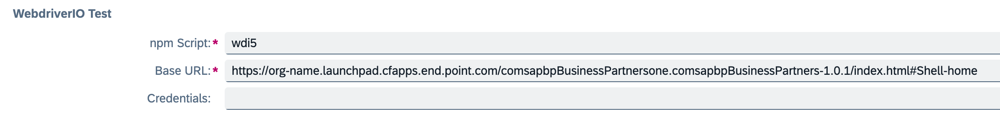
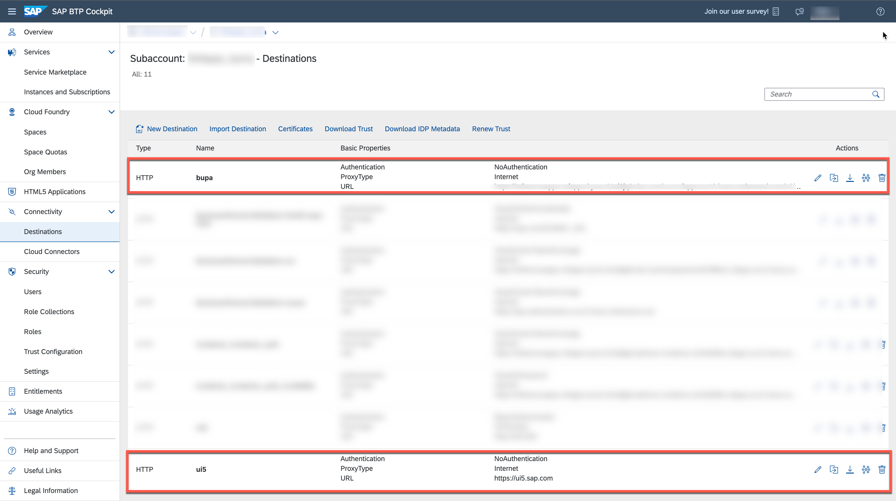

# Run UI tests using the CICD pipeline

NOTE : Make sure your folder is connected to a Github repository. If not yet, fork this mission's repository and clone it on VSCode.

This section describes how to configure and run a predefined continuous integration and delivery (CI/CD) pipeline that automatically performs ui tests on your deployed application.

### Changes to application files

1. Firstly we need to make changes to the some files. This is documented in the [UI-tests](../create-software-tests/create-ui-tests.md) chapter. Please follow steps 2-4 under the **Run UI tests in Your Terminal** section. Ignore this step if done already.

2. Additionally open the app/BusinessPartners/package.json file and change the version of the chromderiver dependency to 114. Now push these changes to your repository. 


### Setup your pipeline

1. [Optional:] Make sure you have [enabled the SAP Continuous Integration and Delivery service](https://developers.sap.com/tutorials/btp-app-ci-cd-btp.html#8bee3e93-2873-4eaf-8b07-8ae0d4aba08b) in your BTP account (In case you have used the Booster to set up the account you already have the entitlement)

2. Open Continuous Integration & Delivery application

- Choose **Services** &rarr; **Instances and Subscriptions**
- Find **Continuous Integration & Delivery** 
- Click on name to open the application

 
 
 4. Now you are on the home page of Continuous Integration & Delivery, where you can configure jobs, repositories and credentials. 

 5. Start by adding your GitHub credentials to connect SAP Continuous Integration and Delivery to your repository. Choose **Credentials**, then click on the **+** icon
 
 5.1 In the pop-up add following data:
 - Name: "github"
 - Username: add your GitHub username/ id
 - Password: enter your GitHub access token 
 
   

 5.2 Choose **create** to finish.

 6. Back in the **Credentials** section choose **+** icon to add a second credential for deploying to SAP BTP, Cloud Foundry environment.

 6.1 In the pop-up add following data:
 - Name: "cf"
 - Username: add your global user name
 - Password: enter global password
 
   
 
 6.2 Choose **create** to finish.

 7. Add a third credential for  getting authenticated into your application while running the tests. For this once again choose the **+** icon. In the pop up add mention the credential name as "wdi5-password" and from the drop down select **Secret Text** and add your subaccount password as the Secret.
 .Then choose **Create**.

8. Navigate to **Jobs** tab in SAP Continuous Integration and Delivery and choose  **+** to create a new job.

7.1 In _General Information_ add a _Job Name, e.g.,  CustomLogic

7.2 Choose **add repository** to add your repository you have created in step 2.
 
  

8. In the pop-up you can configure the connection to your repository:
 - Name: "customLogicRepo"
 - Clone Url: provide URL of your repository
 - Credentials: select the github credentials that you have created in step 5

 Choose **Create**.
 
  


9. Back in the **General Information** section you can further configure your Job
  - Branch: select your github branch, in this example 'main'
  - Pipeline: select SAP Cloud Application Programming Model

  

10. Scroll down to **Stages** --> **Build** and select the build tools:
- Build Tool: mta
- Build Tool Version: Select the latest version

  

11. Scroll down to **Acceptance** and switch on the toggle to allow the executing of the ui tests. Under the **Deploy to Cloud Foundry** section mention your subaccount's details and choose the name of the credential created above for cf deployment.

  

**NOTE : if you are using a subaccount used for any previous deployments of the application mentioned in this mission, it is advised to undeploy existing deployment, if any, using the command :**
```
  cf undpeloy BusinessPartnerValidation --delete-service-keys --delete-services
```

12. Next switch the toggle of the WebdriverIO tests section and mention the script as **wdi5**. For the Base URL, go to chapter [UI Tests](../create-software-tests/create-ui-tests.md), section **Run UI tests in Your Terminal** and string together your URL as mentioned in **Step 6** for appUrl. Make sure to append this URL with #Shell-home. Your configuration should look like this:


**NOTE: The org, space and endpoint names used for stringing together the url of the application should be the same as that mentioned under the **Deploy to Cloud Foundry section** mentioned above.**


13. Next go to **Additional Variables** and click the **+** icon and add environment variables as mentioned in the chapter [UI Tests](../create-software-tests/create-ui-tests.md), section **Run UI tests in Your Terminal**, **Setp 6**. Additionally also create the **wdi5_username** variable as mentioned in **Step 10**. Your variables list should look like:


14. Finally add **Additional Credentials** by clicking the **+** icon and mention the name as **wdi5_password** and choose the Secret Text credential created above called wdi5-password. This should result in :


15. Finish the job creation by choosing **Create**

20. Now you can test your job manually the first time after creation. Go back to the **SAP Continuous Integration and Delivery** application and navigate to the **Job** tab

21. Choose the name of your created job and choose **Run**

  

22. Verify that a new tile appears in the Builds view. This tile should be marked as running.

  

23. Wait until the job has finished and verify that the build tile is marked as successful.

  

24. You can go to the Acceptance Stage and view the same logs you did when running the tests locally on your terminal.

  

25. Now you can go back and undeploy your application using the cf undeploy command. Please ensure to manually delete the destinations **ui5** and **bupa-s4-test** from the **Destinations** section of the BTP Cockpit as it would not be removed during the undeployment stage due it being a subaccount level destination.

  