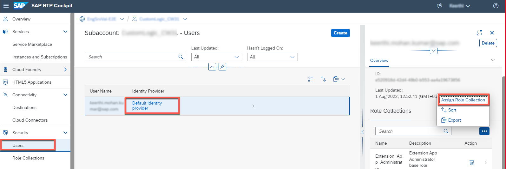

# Setup CI/CD Pipeline

This section describes how to configure and run a predefined continuous integration and delivery (CI/CD) pipeline that automatically tests, builds, and deploys your code changes to speed up your development and delivery cycles.

The steps below will guide your through settting up your pipeline.

1. Enable SAP Continuous Integration and Delivery (optional Step - if you have executed the Booster you should be good)
- Go to your subaccount in SAP BTP
- Got to the Service Marketplace
- Type Continuous into the Search Box
- Choose Create

 

2. Assign Role Collection

- In your SAP BTP subaccount, choose Security -> Trust Configuration
- Choose the name of your identity provider
- Enter your email address
- Choose Show Assignments
- Choose Assign Role Collection

 

- From the dropdown list, choose CICD Administrator

3. Fork the GitHub repository

- Go to the GitHub repository for this mission 
- Fork the GitHub repository


4. Configure pipeline

- Click on *Service Marketplace* or *Instances and Subscriptions*
- Find *Continuous Integration & Delivery* (you might use the search functionality)
- Click on “Go to application”

 
 
 
 5. In the *Jobs* tab of the application click on the "+" to add a new job for sap-cloud-sdk pipeline
 6. Under *General Information* add the following data:
 - Job Name: "customLogic"
 - Repository: Select *add repository*
 
  ![add repository(./images/ci-cd-1.png)

 6.1 In the pop up add following data:
 - Name: "customLogicRepo"
 - Clone Url: provide URL of your repo
 - Credentials: Select *create credentials*
 
  ![add repository(./images/ci-cd-2.png)
 
 6.2 In the pop up add following data:
 - Name: "github"
 - Username: add your GitHub username/ id
 - Password: enter your GitHub access token 
 
   ![add repository(./images/ci-cd-3.png)
 
  Click on *create* to finish
  6.3 Back on the "Add repository" tab click on *add* button
  6.4 Now your back at the *General Information* tab of the application. Here fill out the missing fields like followed:
  - Branch: master
  - Pipeline: SAP Cloud Application Programming Model
  
 ![add repository(./images/ci-cd-4.png)
  
  6.5 Scroll down to *Stages* - *Release* and switch the toggle on
  - Switch on the toggle to deploy to cloud foundry
  - Now add credentials to your cf account
  - 
  

8. Configure Webhooks

The data required below can be found in the CI/CD popup.

- Enter payload url
- Select content type as application/json
- Enter the secret

The details to be entered as available in the pop up in CI/CD.

- Click on ‘Add webhook’

 

9. Add credential to pipeline

- Open pipeline_config.yml file in github
- Edit credentialId and adjust to the one created.
- Click on Commit change

 
 
10. Test the pipeline (optional)
 
 - Go to the terminal in Business Application Studio and sync the changes in GitHub 
 
 ```bash
 git pull
 ```
 
 - Go to Business Application Studio
 - Make a minor change to for example the Readme.MD like e.g. adding a comment
 - Go to the terminal and execute the commands below
 
 ```bash
git add .
git commit -m "minor change"
git push
```
 - Goto the CI/CD app 
 - Check on the right hand side that the build has been triggered
 
  
 

 
