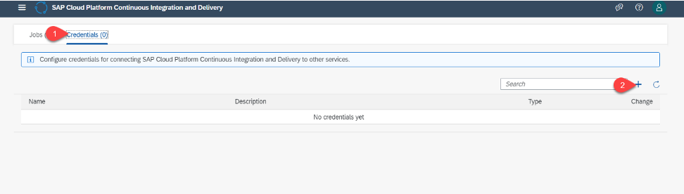
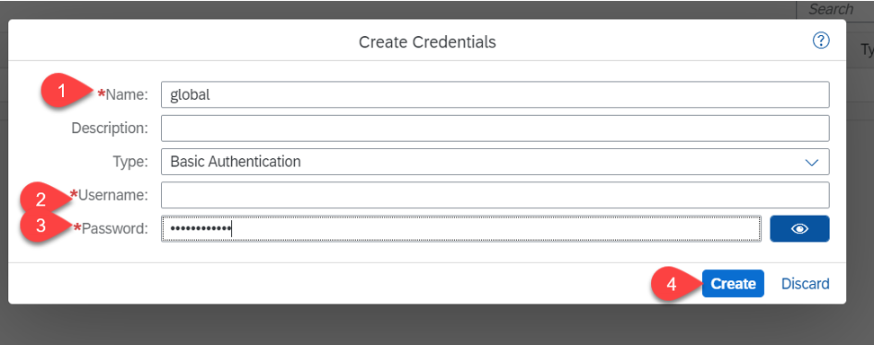
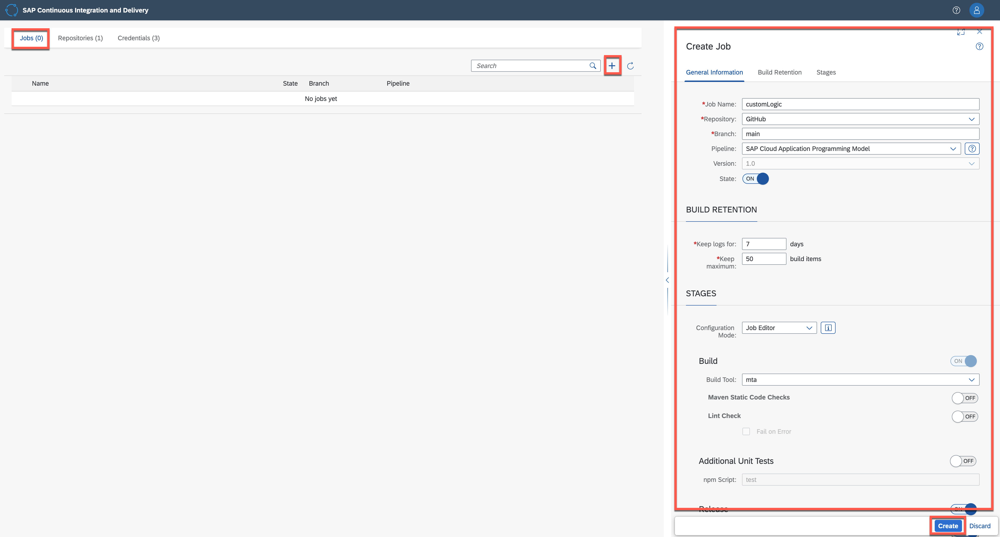
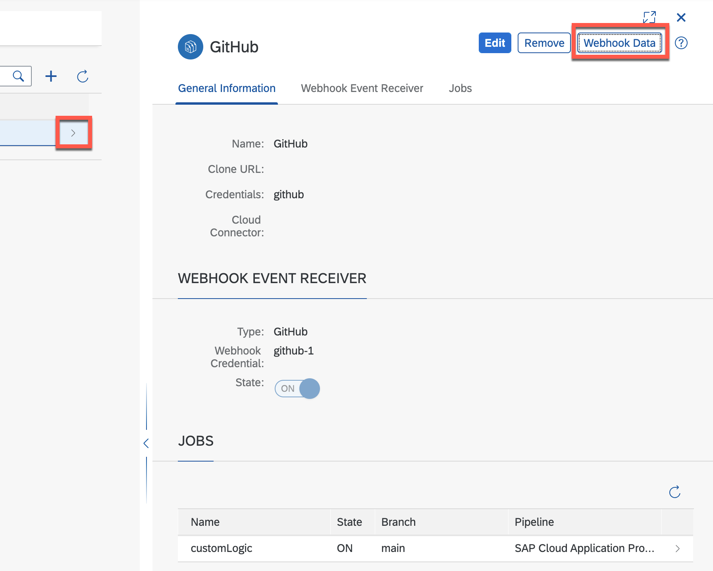

# Setup CI/CD Pipeline

We will now setup our CI/CD pipeline.

1. Fork the GitHub repository

- Go to the GitHub repository. 
- Fork the GitHub repository

2. Go to the Business Application Studio 

- Go to the SAP BTP Cockpit
- Go to *Instances and Subscriptions* or alternatively to *Service Marketplace*
- Start the Business Application Studio by executing *Go to Application*

3. Open a Terminal in the Business Application Studio

- Go to *Terminal* and select *New Terminal*

4. Clone the forked GitHub repository from the terminal in Business Application Studio

- Go to the *projects* folder in your terminal 
- Execute the command below from the projects folder
- In this command replace <your GitHub repository> with your GitHub repository

```bash
git clone <your GitHub repository>
```  

5. Go to the folder you have just cloned. 
6. Execute the command *cds add pipeline*

7. Open config.yml file that you can find on the left in the Explorer window of the Business Application Studio. Open the directory .pipeline and you will find the file there.
8. Edit the config.yml and add the code snippets below at the appropriate spots. 

- Go to the *general* section. 
- Copy the below code snippet and paste it to the general section

```bash
  unsafeMode: false
  projectName: 'cloud-extension-s4hana-business-process'
  productiveBranch: 'main'
```  
  
- Go to the *steps* section
- Copy and add the below over to the steps section

```bash
  artifactPrepareVersion:
    buildTool: 'mta'
  npmExecute:
    dockerImage: 'ppiper/node-browsers:v2'
  cloudFoundryDeploy:
    dockerImage: 'ppiper/cf-cli'
    mtaDeployParameters: '-f --version-rule ALL'
  mtaBuild:
    mtaBuildTool: "cloudMbt"
```

- Go to the *stages* section
- Copy the below over and add it to the section

```bash
  npmAudit:
    auditedAdvisories:
    # high
      - 550   
      - 593
      - 1184
      - 755
      - 1065 
      - 1164 
      - 1316 
      - 1324 
      - 1325 
    # moderate
      - 535
      - 1300 
```

- Go to the *cftargets* section, uncomment the section and update appropriately

The data can be found in the BTP Cockpit in the *Overview* part of your subaccount. Note that *org* is the org name, not the org id.

9. Push the pipeline code to GitHub.

- git add .
- git commit –m “adding pipeline config” or git commit -m 'adding pipeline config'
- git push

Hint: you might have to configure your Git before.

10. Configure pipeline

- Click on *Service Marketplace* or *Instances and Subscriptions*
- Find *Continuous Integration & Delivery* (you might use the search functionality)
- Click on “Go to application”

 

11. Add BTP credentials

- Click on credentials tab
- Click on ‘+’

 
 
- Enter a freely chosen name for your credential, which is unique in your SAP BTP subaccount. In this example, the name of the credential is *global*.
- As type select *Basic Authentication* 
- For Username, enter your GitHub username.
- For Password, use the personal access token for GitHub (Hint: access tokens can be created in GitHub by going to *Settings* -> *Developer Settings*)
- Click on create

 

11. Add GitHub credentials

- Click on ‘+’
- Enter a freely chosen name for your credential, which is unique in your SAP BTP subaccount. In this example, the name of the credential is *github*.
- As type select *Basic Authentication* 
- For Username, enter your GitHub username.
- For Password, use the personal access token for GitHub
- Click on create

 
 
 12. Configure a CI/CD Job
 
- In the Jobs tab in SAP Continuous Integration and Delivery, choose *+* to create a new job.
- For Job Name, enter a freely chosen name for your job, which is unique in your SAP BTP subaccount, for example ‘CustomLogic’.
- Under Repository, choose Add Repository.
- Add the repository name and the repository URL.
- Select the repository credential from the dropdown. Pick *github*
- Choose *Add*

 

- For Branch, enter the GitHub branch from which you want to receive push events. In this example, main.
- As Pipeline, choose SAP Cloud Application Programming Model.
- Keep the default values in the BUILD RETENTION tab.
- In the Stages tab, choose Job Editor from the Configuration Mode dropdown list.
- For Build Tool, leave mta as preselected.
- Leave the execution of the Maven Static Code Checks step switched off.
- Leave the execution of the Lint Check step switched off.
- Leave the execution of the Additional Unit Tests switched off.
- Switch the execution of the Release stage on.
- Switch the execution of the Deploy to Cloud Foundry step on.
- Replace the placeholders in with the values of the space in the Cloud Foundry environment to which you want to deploy. You can get the values from your subaccount overview in the SAP BTP cockpit. Select the Credentials that you had created earlier for the SAP BTP from the dropdown menu.
- Leave the Upload to Cloud Transport Management step switched off. Select the credentials from the drop down that you had created earlier for the SAP BTP.
- Choose *Create*.

 
 
13. Create a GitHub Webhook

To create a webhook in GitHub, you need some data that has been automatically created during the previous step. You can find this data (Payload URL and Secret) when you open the detail view of an existing repository in the Repositories tab

- Click on Repositories
- Open on the Detail View of your repository by clicking on the arrow at the end of the row
- The detail view opens up on the right hand side
- Click on Webhook Data
 
 
 
- You will see a pop-up like the one below
 
 

14. Add Webhook in GitHub

- In your project in GitHub go to the Settings tab.
- From the navigation pane, choose Webhooks.
- Choose Add webhook.

 

14. Configure Webhooks

The data required below can be found in the CI/CD popup.

- Enter payload url
- Select content type as application/json
- Enter the secret

The details to be entered as available in the pop up in CI/CD.

- Click on ‘Add webhook’

 

15. Add credential to pipeline

- Open pipeline_config.yml file in github
- Edit credentialId and adjust to the one created.
- Click on Commit change

 
 
 16. Test the pipeline (optional)
 
 - Go to Business Application Studio
 - Make a minor change to for example the Readme.MD like e.g. adding a comment
 - Go to the terminal and execute the commands below
 
 ```bash
git add .
git commit -m "minor change"
git push
```
 - Goto the CI/CD app 
 - Check on the right hand side that the build has been triggered
 
  
 

 
