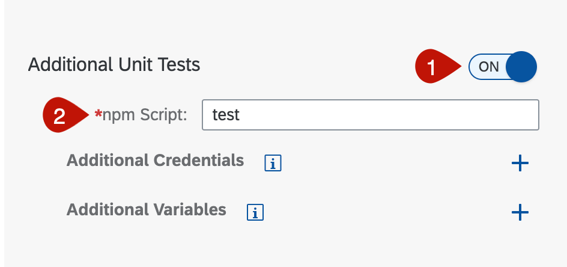
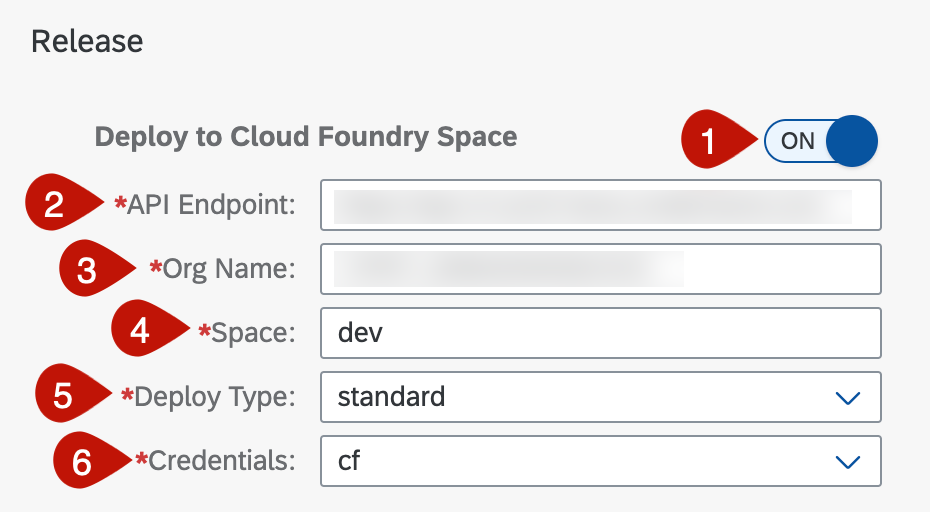
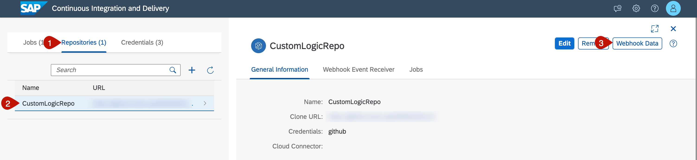
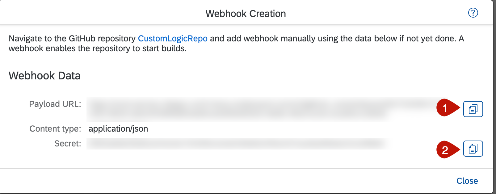
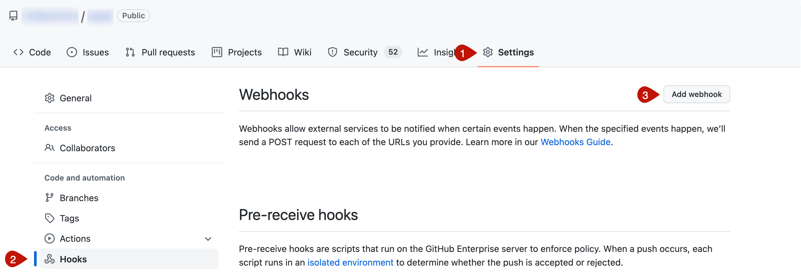
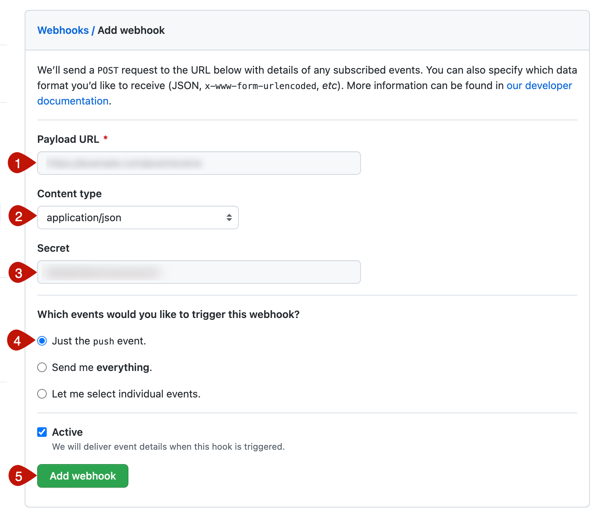

# Setup CI/CD Pipeline

This section describes how to configure and run a predefined continuous integration and delivery (CI/CD) pipeline that automatically tests, builds, and deploys your code changes to speed up your development and delivery cycles.

The steps below will guide your through setting up your pipeline.

1. [Optional:] Make sure you have [enabled the SAP Continuous Integration and Delivery service](https://developers.sap.com/tutorials/btp-app-ci-cd-btp.html#8bee3e93-2873-4eaf-8b07-8ae0d4aba08b) in your BTP account (In case you have used the Booster to set up the account you already have the entitlement)

2. Make sure that by this moment that you have connected your project to a GitHub repository.

-  Go to the GitHub repository for this mission 
-  Fork the GitHub repository

3. Open Continuous Integration & Delivery application

- Choose **Services** &rarr; **Instances and Subscriptions**
- Find **Continuous Integration & Delivery** 
- Click on name to open the application

 
 
 4. Now you are on the home page of Continuous Integration & Delivery, where you can configure jobs, repositories and credentials. 

 5. Start by adding your GitHub credentials to connect SAP Continuous Integration and Delivery to your repository. Choose **Credentials**, then click on the **+** icon
 
 5.1 In the pop-up add following data:
 - Name: "github"
 - Username: add your GitHub username/ id
 - Password: enter your GitHub access token 
 
   

 5.2 Choose **create** to finish.

 6. Back in the **Credentials** section choose **+** icon to add a second credential for deploying to SAP BTP, Cloud Foundry environment.

 6.1 In the pop-up add following data:
 - Name: "cf"
 - Username: add your global user name
 - Password: enter global password
 
   
 
 6.2 Choose **create** to finish.

7. Navigate to **Jobs** tab in SAP Continuous Integration and Delivery and choose  **+** to create a new job.

7.1 In _General Information_ add a _Job Name, e.g.,  CustomLogic

7.2 Choose **add repository** to add your repository you have created in step 2.
 
  

8. In the pop-up you can configure the connection to your repository:
 - Name: "customLogicRepo"
 - Clone Url: provide URL of your repository
 - Credentials: select the github credentials that you have created in step 5

 Choose **Create**.
 
  

9. Back in the **General Information** section you can further configure your Job
  - Branch: select your github branch, in this example 'main'
  - Pipeline: select SAP Cloud Application Programming Model

  

10. Scroll down to **Stages** --> **Build** and select the build tools:
- Build Tool: mta
- Build Tool Version: Select the latest version

  

11. Scroll down to **Additional Unit Tests** and switch on the toggle to allow the executing of unit test. Then select your created **test script**

  

12.  Scroll down to **Release** and switch the toggle on to deploy to cloud foundry
- API endpoint: enter the api endpoint of your BTP account
- Org name: enter the org name of in your BTP account
- Space: select cf space, e.g.,  dev 
- Credentials: add the cf credential you have created in step 6 e.g.'cf'.

  
> Hint: You can find the information in the overview section of your BTP account.

13. Finish the job creation by choosing **Create**

14. As a next step you will create a GitHub webhook. GitHub webhooks allow you to automate CI/CD builds. Whenever you push changes to your GitHub repository, a webhook push event is sent to the service to trigger a build of the connected job. Switch to the **Repositories** tab

15. Choose the name of your connected repository and choose **Webhook Data** button on the right site of the screen.

  

16. This opens a pop-up containing the_Payload URL_ and _Secret_, which you need to create the webhook. Find the information and copy it for the next step

  

17. Then open your GitHub repository to do the configuration from needed from GitHub page

18. Navigate to **Settings** and choose **Hooks** in the menu on the left. Then choose **Add Webhook**

  

19. Add the date that you have copied in step 16.
 - Payload url
 - Content type: application/json
 - Secret

 Choose **Add Webhook**

  

20. Now you can test your job manually the first time after creation. Go back to the **SAP Continuous Integration and Delivery** application and navigate to the **Job** tab

21. Choose the name of your created job and choose **Run**

  

22. Verify that a new tile appears in the Builds view. This tile should be marked as running.

  

23. Wait until the job has finished and verify that the build tile is marked as successful.

  