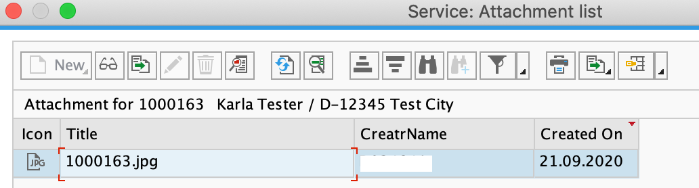

## Test Entire Business Scenario End to End
1. Start your Business Partner Validation Application

- In the command line interface run the command *cf apps*

- Find the URL for the app BusinessPartnerValidation-ui - this is the launch URL for the Business Partner Validation application.

- Launch the URL in a browser.

- Click on Business Partner Validation tile

- The list of BusinessPartners along with their verification status gets displayed.

 

2. Login to your SAP S/4HANA On Prem System

 

3. Enter transaction code *bp*

 

4. Create a new Business Partner

- Click on Person

 
 
- Provide first name, last name for the business partner
 
 
  
- Provide the address  
  
 
 
 - Move to the status tab and check mark the 'Central Block' lock. Save the BP. This will create a new Business Partner
   
 

5. Now go back to the BusinessPartnerValidation application to see if the new BusinessPartner has appeared as a new entry in the UI

 

6. Go to the details page for the new BusinessPartner.
7. Click on Edit and set the Status to *Verified*

 

8. (Optional) You can configure Event Mesh in a way so that you can see the created Event. For that you could create an additional queue that subscribes to the topic as well.

 

9. Go to your S/4HANA On Prem System 
10. Go to transaction *bp*

 

11. Open the details of the Business Partner you have just set to *Verified*

 

12. Go to the Status tab. You can see that the central Block lock has been removed.

 

13. The serverless application has also uploaded a QR code for the address details of the BP to the S/4HANA system. You can view this by clicking on the icon in the top left corner. You will have to give permission for downloading the image.

 
 
 

14. (Optional) Go to the Extension Center and check on the logs for your Serverless Function 

 
