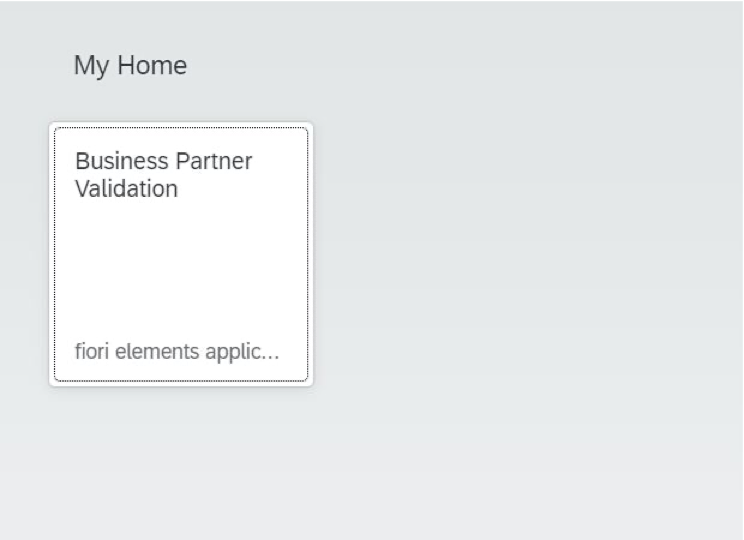
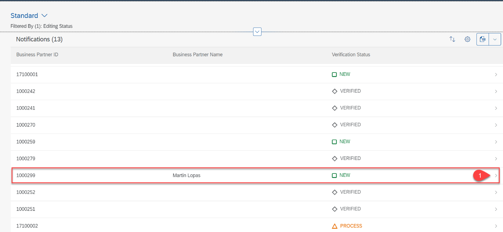

# Test Basic Scenario End to End
## Introduction

Now it is time to test your basic scenario. As a result of the following steps you will be able start up your application, create an event in your S/4HANA On Premise system and see the Business Partner you have created appear in your application.

**Persona:** SAP Cloud Platform Developer

### Deploy and Start Application

1. Go to SAP Business Application Studio 
2. Open a new terminal
3. Run *cf apps*
4. Find the URL for the app BusinessPartnerValidation-ui. This is the launch URL for the Business Partner Validation application.
5. Copy the URL into a browser and launch your extension app.

### Test the Application

1. Click on Business Partner Validation tile

2. The list of BusinessPartners along with their verification status gets displayed.

3. Login to the S/4HANA on premise system

4. Enter transaction code 'bp' to go to the Maintain Business Partner transaction.

5. Click on Person

6. Provide first name, last name for the business partner

7. Provide the address

8. Move to the status tab and check mark the 'Central Block' lock. 
9. Save the BP. This will create a new Business Partner.

10. Go back to your BusinessPartnerValidation application running in your browser to see if the new BusinessPartner has been added. You might have to refresh your browser.

11. Go to the details page for the new BusinessPartner.

12. Optionally you can click on edit and check out your options.
